# Bab 4: Administrasi Moodle

Setelah berhasil menginstal Moodle, langkah selanjutnya adalah melakukan konfigurasi dan administrasi sistem. Pada bab ini, kita akan mempelajari berbagai aspek administrasi Moodle mulai dari konfigurasi dasar hingga pengaturan lanjutan.

## Pengenalan Site Administration

Site Administration adalah pusat kontrol untuk mengatur seluruh aspek sistem Moodle. Hanya user dengan role Administrator yang memiliki akses penuh ke area ini.

### Mengakses Site Administration

1. Login sebagai Administrator
2. Klik **Site administration** di sidebar kiri
3. Atau akses melalui user menu → **Site administration**

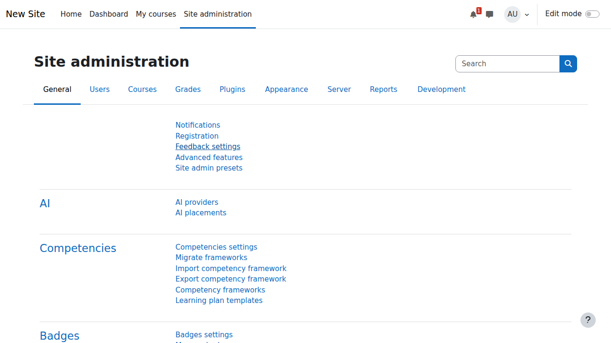

## Konfigurasi Dasar Situs

### 1. Site Settings

#### General Settings
1. Navigate ke **Site administration** → **General** → **Basic settings**
2. Konfigurasi pengaturan utama:
   - **Site name**: Nama situs yang akan muncul di title bar
   - **Site description**: Deskripsi singkat tentang situs
   - **Front page summary**: Teks yang muncul di halaman depan
   - **Maximum upload file size**: Ukuran maksimum file yang bisa diupload

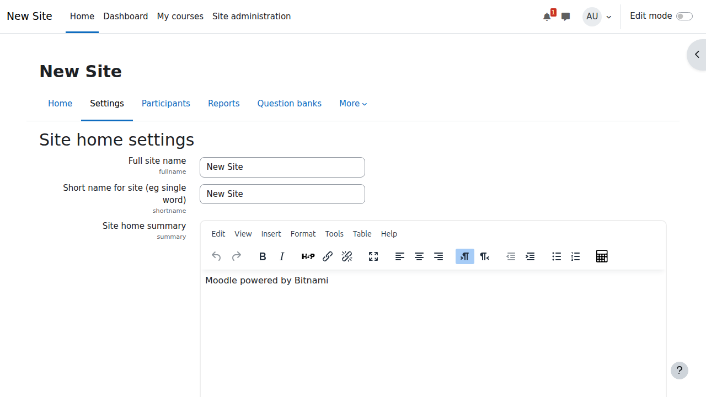

**Pengaturan Penting:**
```
Site name: Moodle Learning Platform
Site description: Platform pembelajaran online untuk institusi pendidikan
Front page summary: Selamat datang di platform pembelajaran online kami
Maximum upload file size: 50MB (atau sesuai kebutuhan)
```

#### Front Page Settings
1. Go to **Site administration** → **Front page** → **Front page settings**
2. Configure:
   - **Front page**: Pilih layout halaman depan
   - **Include a topic section**: Aktifkan jika ingin section konten
   - **News items to show**: Jumlah berita yang ditampilkan
   - **Course summary**: Tampilkan ringkasan course


### 2. Language Settings

#### Default Language
1. Navigate ke **Site administration** → **Language** → **Language settings**
2. Set:
   - **Default language**: Bahasa default sistem (ID untuk Indonesia)
   - **Display language menu**: Tampilkan menu pemilihan bahasa
   - **Cache language menu**: Cache menu bahasa untuk performa

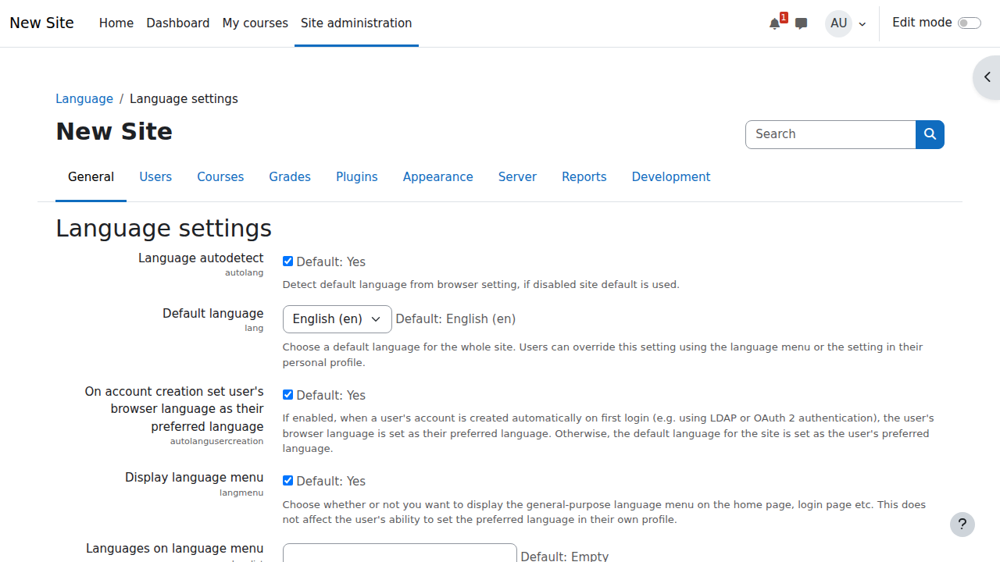

#### Installing Language Packs
1. Go to **Site administration** → **Language** → **Language packs**
2. Select additional languages dari dropdown
3. Click **Install selected language pack(s)**

Recommended language packs:
- **Indonesian (id)** - Bahasa Indonesia
- **English (en)** - Default language


### 3. Location Settings

1. Navigate ke **Site administration** → **Location** → **Location settings**
2. Configure:
   - **Default timezone**: Asia/Jakarta untuk Indonesia
   - **Force timezone**: Paksa semua user menggunakan timezone ini
   - **Default country**: Indonesia


## User Management

### 1. Authentication Methods

#### Managing Authentication
1. Go to **Site administration** → **Plugins** → **Authentication** → **Manage authentication**
2. Available methods:
   - **Email-based self-registration**: User register sendiri via email
   - **Manual accounts**: Admin membuat account manual
   - **LDAP server**: Integrasi dengan LDAP
   - **External database**: Database eksternal


**Recommended Settings:**
- Enable **Email-based self-registration** untuk public course
- Enable **Manual accounts** untuk kontrol penuh admin
- Disable yang tidak diperlukan untuk security

#### Email-based Self-registration Settings
1. Click **Settings** pada Email-based self-registration
2. Configure:
   - **Require email confirmation**: Ya, untuk verifikasi email
   - **Default role**: Student (role default untuk user baru)
   - **Auth instructions**: Instruksi untuk user


### 2. User Policies

1. Navigate ke **Site administration** → **Users** → **Permissions** → **User policies**
2. Important settings:
   - **Guest login button**: Tampilkan tombol guest login
   - **Alternate login URL**: URL login alternatif
   - **Forgotten password URL**: URL reset password
   - **Maximum time to edit posts**: Waktu edit posting maksimal

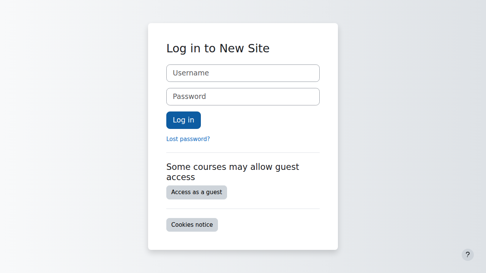

### 3. Default Role Assignment

1. Go to **Site administration** → **Users** → **Permissions** → **Global roles**
2. Set default roles:
   - **Default role for all users**: Authenticated user
   - **Guest role**: Guest
   - **Default frontpage role**: Frontpage

## Site Security

### 1. Security Settings

#### Site Security Policies
1. Navigate ke **Site administration** → **Security** → **Site security settings**
2. Critical settings:
   - **Open to Google**: Allow Google indexing
   - **Force users to login**: Paksa login untuk akses konten
   - **Force users to login for profiles**: Paksa login untuk lihat profile
   - **Protect usernames**: Sembunyikan username dari publik


**Recommended Security Configuration:**
```
Open to Google: No (untuk private learning)
Force users to login: Yes
Force users to login for profiles: Yes
Protect usernames: Yes
Maximum session time: 8 hours
```

#### HTTP Security
1. Go to **Site administration** → **Security** → **HTTP security**
2. Configure:
   - **Use HTTPS for logins**: Ya, untuk login aman
   - **Cookie secure**: Enable jika menggunakan HTTPS
   - **Cookie same site**: Lax untuk kompatibilitas


### 2. IP Blocker

1. Navigate ke **Site administration** → **Security** → **IP blocker**
2. Add blocked IP ranges:
   - Format: `192.168.1.0/24` untuk block subnet
   - Format: `192.168.1.100` untuk block IP spesifik
3. Add allowed IP ranges jika diperlukan


### 3. Notifications

1. Go to **Site administration** → **Security** → **Notifications**
2. Review security notifications
3. Take action untuk issues yang ditemukan

Common security notifications:
- **Unsecured dataroot**: Pastikan dataroot tidak accessible via web
- **Display errors**: Disable error display di production
- **Password policy**: Set password policy yang kuat

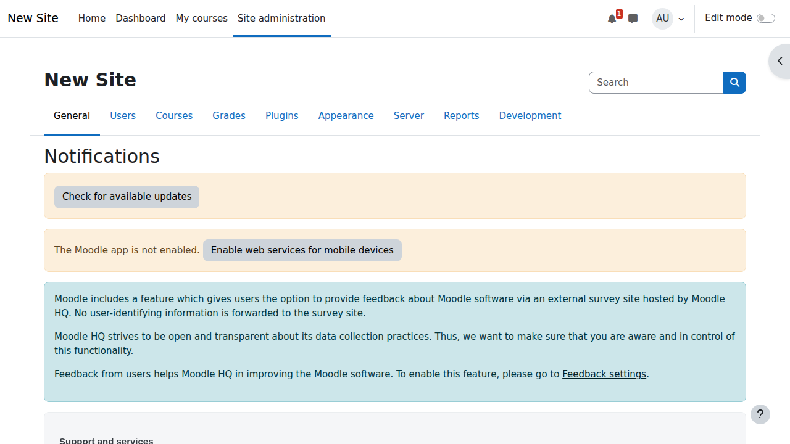

## Appearance and Themes

### 1. Theme Settings

#### Selecting Theme
1. Navigate ke **Site administration** → **Appearance** → **Themes** → **Theme selector**
2. Choose theme untuk different device types:
   - **Default theme**: Theme utama untuk desktop
   - **Mobile theme**: Theme untuk mobile devices
   - **Tablet theme**: Theme untuk tablet

Popular themes:
- **Boost**: Modern responsive theme (recommended)
- **Classic**: Traditional Moodle appearance
- **More**: Theme dengan sidebar yang dapat dikustomisasi

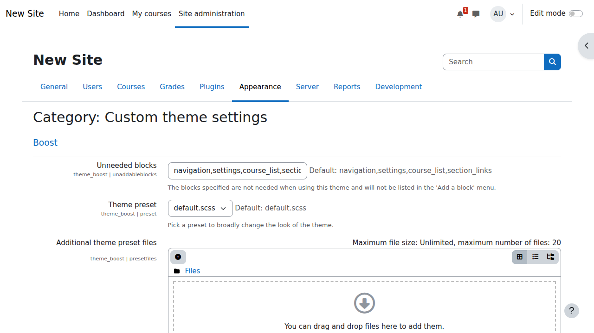

#### Theme Settings
1. Go to **Site administration** → **Appearance** → **Themes** → **Boost** (atau theme yang dipilih)
2. Customize:
   - **Preset**: Color scheme preset
   - **Brand color**: Warna utama brand
   - **Advanced settings**: Custom CSS


### 2. Theme Management dan Installation

#### Installing New Themes

##### Method 1: Install dari Moodle Plugins Directory
1. Navigate ke **Site administration** → **Plugins** → **Install plugins**
2. Search theme yang diinginkan
3. Click **Install now**
4. Follow installation wizard
5. Activate theme di Theme selector

##### Method 2: Manual Installation
1. Download theme dari sumber terpercaya
2. Extract file theme
3. Upload ke folder `/theme/` di Moodle installation
4. Navigate ke **Site administration** → **Notifications**
5. Complete installation process
6. Activate theme di Theme selector

##### Method 3: Install via Docker (untuk setup Docker)
```bash
# Masuk ke container
docker compose exec moodle bash

# Navigate ke theme directory
cd /bitnami/moodle/theme

# Download theme (contoh: Moove theme)
wget https://github.com/willianmano/moodle-theme_moove/archive/refs/heads/master.zip
unzip master.zip
mv moodle-theme_moove-master moove

# Set permissions
chown -R bitnami:root moove
chmod -R 755 moove

# Exit container
exit
```

Setelah install, visit **Site administration** → **Notifications** untuk complete installation.

#### Switching Themes
1. Go to **Site administration** → **Appearance** → **Themes** → **Theme selector**
2. Click **Change theme** pada device type yang diinginkan
3. Preview available themes
4. Click **Use theme** untuk theme yang dipilih
5. Save changes

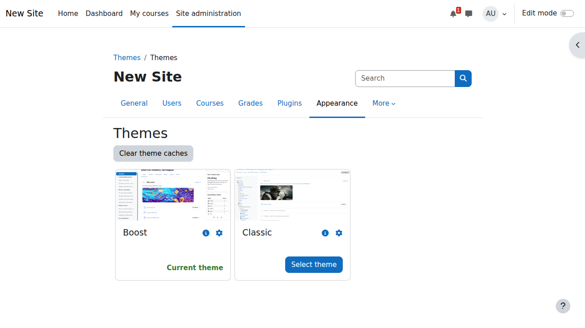

### 3. Free Moodle Themes

#### Premium-Quality Free Themes

##### 1. **Moove**
- **URL**: https://moodle.org/plugins/theme_moove
- **Features**:
  - Modern dan clean design
  - Fully responsive
  - Custom login page
  - Marketing sections
  - Social media integration
- **Best for**: Universitas dan institusi pendidikan
- **Download**: https://github.com/willianmano/moodle-theme_moove

##### 2. **Eguru**
- **URL**: https://moodle.org/plugins/theme_eguru
- **Features**:
  - Professional look
  - Multiple color schemes
  - Custom slider
  - Marketing spots
  - Quick links section
- **Best for**: Corporate training dan e-learning platforms
- **Download**: https://github.com/ProjetoSophiaDev/eguru4

##### 3. **Academi**
- **URL**: https://moodle.org/plugins/theme_academi
- **Features**:
  - Bootstrap 4 based
  - Multiple layouts
  - Custom blocks
  - Responsive design
  - RTL support
- **Best for**: Academic institutions
- **Download**: From Moodle plugins directory

##### 4. **Lambda**
- **URL**: https://moodle.org/plugins/theme_lambda
- **Features**:
  - Highly customizable
  - Multiple layouts
  - Social media icons
  - Custom footer
  - Slideshow support
- **Best for**: General purpose educational sites
- **Download**: https://github.com/bmbrands/moodle-theme_lambda

##### 5. **Fordson**
- **URL**: https://moodle.org/plugins/theme_fordson
- **Features**:
  - Enhanced navigation
  - Icon navigation
  - Custom presets
  - Marketing tiles
  - Course search enhancement
- **Best for**: K-12 schools
- **Download**: https://github.com/dbnschools/moodle-theme_fordson

##### 6. **Adaptable**
- **URL**: https://moodle.org/plugins/theme_adaptable
- **Features**:
  - Highly flexible
  - Multiple regions
  - Custom CSS/JS
  - Alert system
  - Analytics integration
- **Best for**: Advanced users yang butuh customization
- **Download**: https://gitlab.com/jezhops/moodle-theme_adaptable

##### 7. **Trema**
- **URL**: https://moodle.org/plugins/theme_trema
- **Features**:
  - Clean modern design
  - Dark mode support
  - Custom frontpage
  - Login background customization
  - Social icons
- **Best for**: Modern educational platforms
- **Download**: https://github.com/trema-tech/moodle-theme_trema

##### 8. **Edumy**
- **URL**: https://moodle.org/plugins/theme_edumy
- **Features**:
  - Marketplace style
  - Course cards
  - Advanced search
  - Instructor profiles
  - Responsive galleries
- **Best for**: Online course marketplaces
- **Download**: From Moodle plugins directory

##### 9. **Klass**
- **URL**: https://moodle.org/plugins/theme_klass
- **Features**:
  - Simple dan clean
  - Fast loading
  - Grid layout
  - Custom blocks
  - Mobile friendly
- **Best for**: Minimalist approach
- **Download**: From Moodle plugins directory

##### 10. **Essential**
- **URL**: https://moodle.org/plugins/theme_essential
- **Features**:
  - Comprehensive settings
  - Marketing spots
  - Analytics
  - Social networking
  - Extensive documentation
- **Best for**: Feature-rich installations
- **Download**: https://github.com/gjbarnard/moodle-theme_essential

#### Theme Comparison Table

| Theme | Best For | Customization | Performance | Mobile Support | Special Features |
|-------|----------|---------------|-------------|----------------|------------------|
| Moove | Universities | High | Good | Excellent | Marketing sections |
| Eguru | Corporate | Medium | Good | Good | Professional look |
| Academi | Academic | High | Good | Excellent | Bootstrap 4 |
| Lambda | General | Very High | Medium | Good | Multiple layouts |
| Fordson | K-12 | High | Good | Excellent | Icon navigation |
| Adaptable | Advanced | Very High | Medium | Good | Analytics ready |
| Trema | Modern | Medium | Excellent | Excellent | Dark mode |
| Edumy | Marketplace | High | Good | Excellent | Course cards |
| Klass | Minimalist | Low | Excellent | Good | Simple design |
| Essential | Feature-rich | Very High | Medium | Good | Comprehensive |

### 4. Theme Customization

#### Basic Customization
1. Navigate ke theme settings page
2. Common customization options:
   - **Logo**: Upload institution logo
   - **Favicon**: Small icon untuk browser tab
   - **Colors**: Primary, secondary, accent colors
   - **Fonts**: Typography settings
   - **Layout**: Sidebar positions, width settings

#### Advanced Customization

##### Custom CSS
1. Go to theme settings → Advanced settings
2. Add custom CSS code:
```css
/* Example: Change primary color */
.navbar-light {
    background-color: #2c3e50 !important;
}

/* Example: Custom course card styling */
.course-card {
    border-radius: 10px;
    box-shadow: 0 2px 4px rgba(0,0,0,0.1);
}

/* Example: Hide specific elements */
.hidden-element {
    display: none !important;
}
```

##### Custom JavaScript
1. Add di Additional HTML settings
2. Example customizations:
```javascript
// Add custom functionality
document.addEventListener('DOMContentLoaded', function() {
    // Custom code here
});
```

### 5. Theme Development Resources

#### Documentation dan Tutorials
- **Official Moodle Theme Development**: https://docs.moodle.org/dev/Themes
- **Theme Development Tutorial**: https://docs.moodle.org/dev/Creating_a_theme
- **Bootstrap in Moodle**: https://docs.moodle.org/dev/Bootstrap
- **Mustache Templates**: https://docs.moodle.org/dev/Templates

#### Development Tools
- **Theme Designer Mode**: Enable untuk easier development
- **Theme Debugger**: Untuk troubleshooting
- **Cache Purge**: Clear theme cache saat development

#### Community Resources
- **Moodle Themes Forum**: https://moodle.org/mod/forum/view.php?id=46
- **GitHub Repositories**: Search "moodle theme" untuk examples
- **Moodle Partners**: Professional theme development services

### 6. Best Practices untuk Theme Management

#### Selection Criteria
1. **Compatibility**: Pastikan compatible dengan Moodle version
2. **Responsiveness**: Test di berbagai devices
3. **Performance**: Check loading speed
4. **Accessibility**: WCAG compliance
5. **Support**: Active development dan community

#### Testing Process
1. **Install di test environment first**
2. **Test dengan different browsers**
3. **Check mobile responsiveness**
4. **Verify all functions work**
5. **Test dengan real content**

#### Maintenance Tips
1. **Regular Updates**: Keep themes updated
2. **Backup Before Changes**: Always backup
3. **Document Customizations**: Track changes made
4. **Monitor Performance**: Check impact on load times
5. **User Feedback**: Collect dan respond to feedback

### 7. Troubleshooting Theme Issues

#### Common Problems dan Solutions

**Problem: Theme not appearing after installation**
- Solution: Clear all caches
- Check file permissions
- Verify installation path correct

**Problem: Broken layout after theme switch**
- Solution: Purge theme cache
- Reset theme settings
- Check for conflicting custom CSS

**Problem: Slow performance with new theme**
- Solution: Optimize images
- Minimize custom CSS/JS
- Enable theme caching
- Check for heavy resources

**Problem: Mobile display issues**
- Solution: Check responsive settings
- Test dengan real devices
- Verify mobile theme settings
- Update theme ke latest version

### 8. Navigation

1. Navigate ke **Site administration** → **Appearance** → **Navigation**
2. Configure:
   - **Default home page**: Halaman default setelah login
   - **Include categories in nav**: Include course categories
   - **Sort my courses**: Urutan course di navigation


### 9. HTML Settings

1. Go to **Site administration** → **Appearance** → **Additional HTML**
2. Add custom HTML/CSS/JavaScript:
   - **Within HEAD**: Code di dalam tag head
   - **When BODY is opened**: Code setelah opening body tag
   - **Before BODY is closed**: Code sebelum closing body tag


## Course Management

### 1. Course Default Settings

1. Navigate ke **Site administration** → **Courses** → **Course default settings**
2. Configure defaults untuk course baru:
   - **Course format**: Format course default (Topics, Weekly, dll)
   - **Maximum upload size**: Upload size per course
   - **Show gradebook to students**: Tampilkan gradebook
   - **Show activity completion**: Tampilkan completion tracking

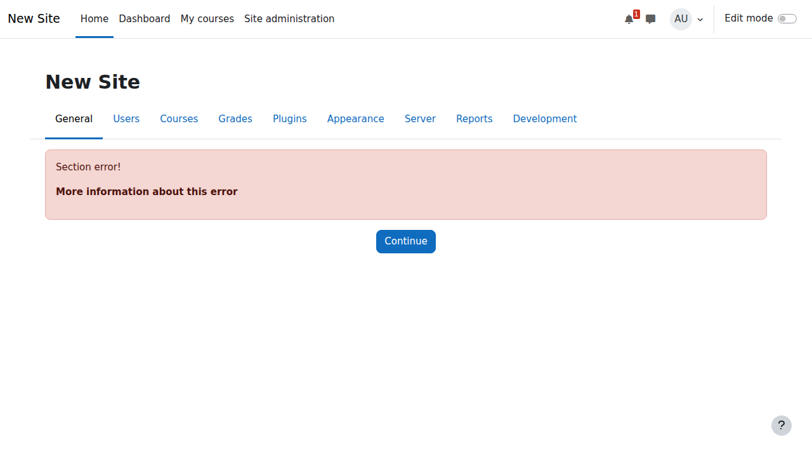

### 2. Course Request

1. Go to **Site administration** → **Courses** → **Course request**
2. Enable course request jika ingin user bisa request course baru
3. Set default category untuk course request
4. Configure notification settings


### 3. Backup Settings

#### Automated Backups
1. Navigate ke **Site administration** → **Courses** → **Backups** → **Automated backup setup**
2. Configure:
   - **Active**: Enable automated backups
   - **Days of week**: Hari untuk backup otomatis
   - **Execution time**: Waktu eksekusi backup
   - **Save to**: Lokasi penyimpanan backup

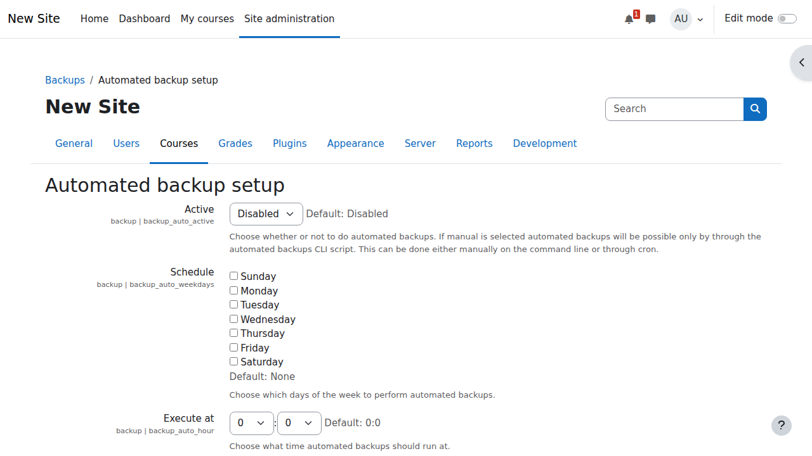

**Recommended Backup Settings:**
```
Active: Yes
Days of week: Daily (atau sesuai kebutuhan)
Execution time: 02:00 (jam 2 pagi)
Save to: File system dan external location
Keep: 7 backups (1 minggu)
```

## Plugin Management

### 1. Plugin Overview

1. Go to **Site administration** → **Plugins** → **Plugins overview**
2. View all installed plugins
3. Check for updates
4. Enable/disable plugins sesuai kebutuhan

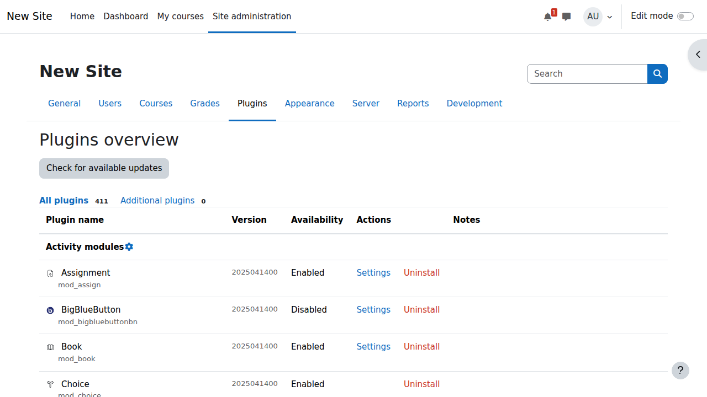

### 2. Install Plugins

#### Installing from Moodle Directory
1. Navigate ke **Site administration** → **Plugins** → **Install plugins**
2. Search plugin di Moodle plugins directory
3. Click **Install** untuk plugin yang diinginkan
4. Follow installation wizard

#### Manual Plugin Installation
1. Download plugin dari source
2. Extract ke direktori yang sesuai:
   - `/path/to/moodle/[plugintype]/[pluginname]`
3. Visit **Site administration** → **Notifications**
4. Complete installation process


### 3. Popular Plugins

**Recommended Plugins:**
- **BigBlueButton**: Video conferencing
- **H5P**: Interactive content
- **Plagiarism detection**: Anti-plagiarism tools
- **Mobile app**: Official Moodle mobile app support
- **Zoom**: Zoom meeting integration

## System Monitoring

### 1. System Information

1. Navigate ke **Site administration** → **Server** → **System information**
2. Review:
   - **Moodle version**: Versi Moodle yang digunakan
   - **Database**: Informasi database
   - **PHP version**: Versi PHP
   - **Web server**: Informasi web server

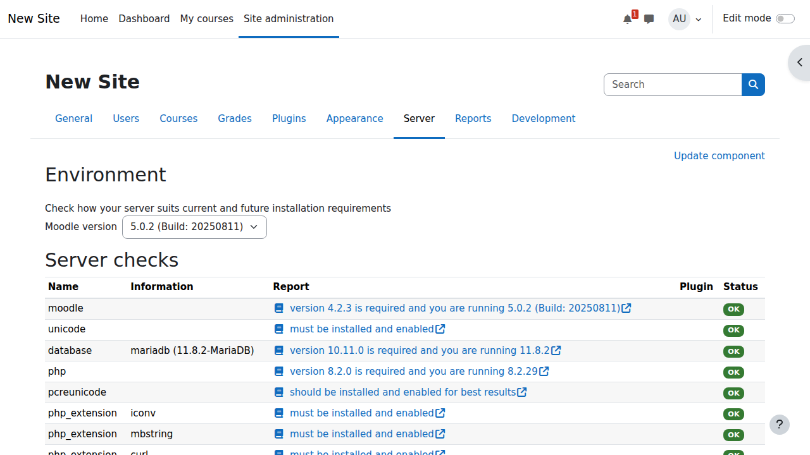

### 2. Environment

1. Go to **Site administration** → **Server** → **Environment**
2. Check system requirements compliance
3. Review recommendations
4. Fix any issues yang ditemukan


### 3. PHP Info

1. Navigate ke **Site administration** → **Server** → **PHP info**
2. Review PHP configuration
3. Check loaded extensions
4. Verify important settings

Important PHP settings untuk Moodle:
- `memory_limit`: 512M atau lebih
- `max_execution_time`: 300 atau lebih
- `post_max_size`: 50M atau sesuai kebutuhan
- `upload_max_filesize`: 50M atau sesuai kebutuhan

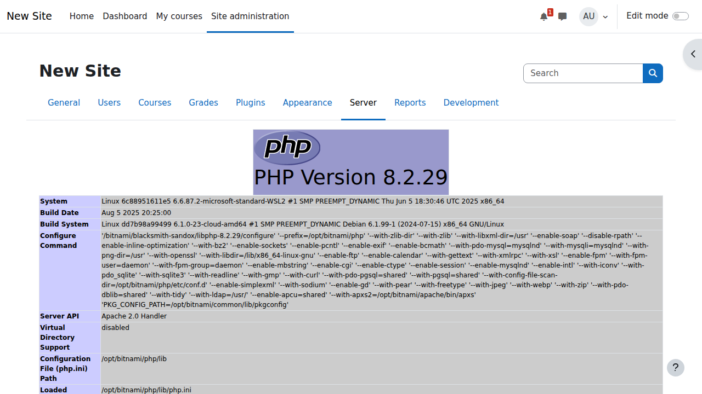

## Performance Optimization

### 1. Caching

#### General Cache Configuration
1. Go to **Site administration** → **Plugins** → **Caching** → **Configuration**
2. Configure cache stores:
   - **File**: Default file cache
   - **Session**: Session cache
   - **Static**: Static cache untuk performa


#### Cache Performance
1. Navigate ke **Site administration** → **Plugins** → **Caching** → **Test performance**
2. Run performance test untuk different cache stores
3. Optimize berdasarkan hasil test

### 2. Database Optimization

1. Go to **Site administration** → **Server** → **Tasks** → **Database transfer**
2. Regular maintenance:
   - Check database size growth
   - Run database optimization
   - Monitor slow queries

### 3. File Management

1. Navigate ke **Site administration** → **Server** → **File management**
2. Review:
   - **File storage**: Total file storage usage
   - **Temp files**: Temporary files cleanup
   - **Backup files**: Backup file management

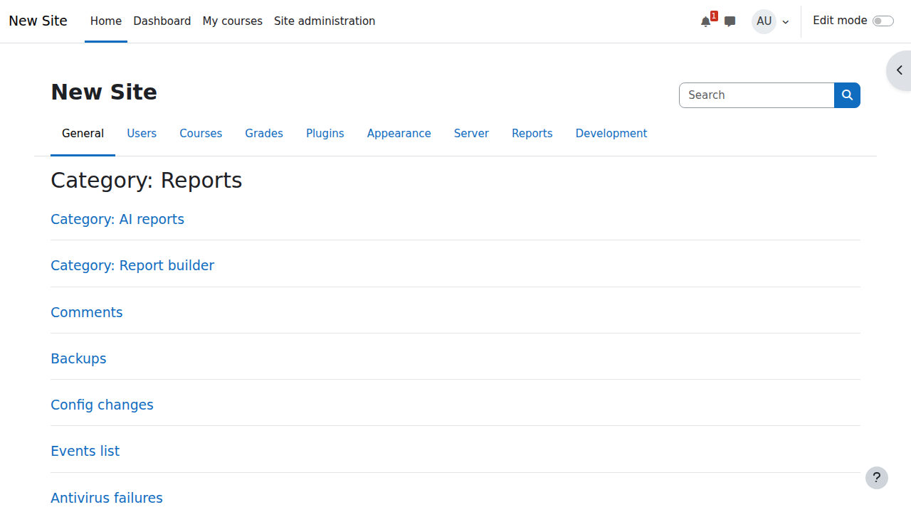

## Maintenance Mode

### 1. Enable Maintenance Mode

1. Go to **Site administration** → **Server** → **Maintenance mode**
2. Enable untuk maintenance:
   - **Enable maintenance mode**: Yes
   - **Maintenance message**: Pesan untuk users
   - **Additional information**: Info tambahan

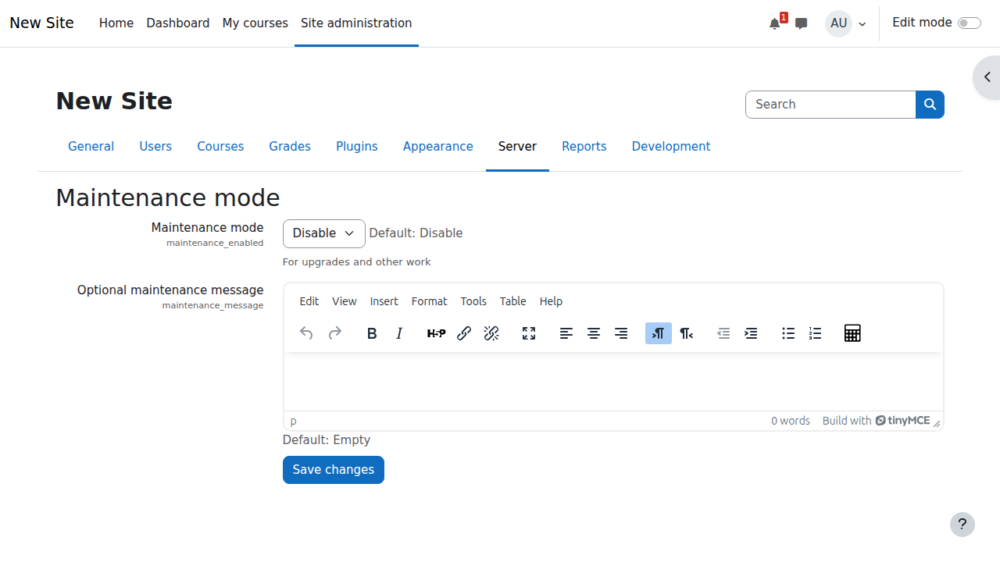

Gunakan maintenance mode untuk:
- System updates
- Database maintenance
- Plugin installation/updates
- System migration

### 2. CLI Maintenance

Alternative via command line:
```bash
# Enable maintenance mode
docker compose exec moodle php admin/cli/maintenance.php --enable

# Disable maintenance mode
docker compose exec moodle php admin/cli/maintenance.php --disable
```

## Troubleshooting Common Issues

### 1. Performance Issues

**Symptoms:**
- Slow page loading
- High server load
- Database timeouts

**Solutions:**
1. Enable caching
2. Optimize database
3. Increase PHP memory limit
4. Use CDN untuk static files

### 2. Login Issues

**Symptoms:**
- Cannot login
- Session expires quickly
- Redirect loops

**Solutions:**
1. Check session settings
2. Verify database connection
3. Clear browser cache
4. Check authentication settings

### 3. Upload Issues

**Symptoms:**
- Cannot upload files
- File size errors
- Permission denied

**Solutions:**
1. Check PHP upload settings
2. Verify folder permissions
3. Increase upload limits
4. Check disk space

## Best Practices

### 1. Security Best Practices

1. **Regular Updates**
   - Update Moodle secara berkala
   - Update plugins
   - Monitor security notifications

2. **Strong Authentication**
   - Enforce strong passwords
   - Enable two-factor authentication
   - Regular audit user accounts

3. **Access Control**
   - Principle of least privilege
   - Regular review user roles
   - Monitor admin activities

### 2. Performance Best Practices

1. **Caching Strategy**
   - Enable appropriate caching
   - Use external cache stores
   - Monitor cache performance

2. **Database Optimization**
   - Regular database maintenance
   - Monitor query performance
   - Optimize database configuration

3. **File Management**
   - Regular cleanup temporary files
   - Monitor disk usage
   - Implement file retention policies

### 3. Backup Best Practices

1. **Regular Backups**
   - Daily automated backups
   - Weekly full system backups
   - Test restore procedures

2. **Multiple Backup Locations**
   - Local backup storage
   - Remote backup storage
   - Cloud backup solutions

3. **Backup Verification**
   - Regular restore testing
   - Verify backup integrity
   - Document recovery procedures

## Kesimpulan

Administrasi Moodle yang baik memerlukan pemahaman mendalam tentang berbagai aspek sistem. Key points yang perlu diingat:

1. **Site Configuration**: Setup yang tepat dari awal sangat penting
2. **Security**: Implementasi security policies yang ketat
3. **Performance**: Monitoring dan optimization berkelanjutan
4. **Maintenance**: Regular maintenance dan updates
5. **Backup**: Strategi backup yang robust

Dengan mengikuti best practices di atas, sistem Moodle Anda akan berjalan optimal, aman, dan reliable untuk mendukung kegiatan pembelajaran.

---

**Tips Administrasi:**
- Document semua konfigurasi yang dilakukan
- Monitor system performance secara berkala
- Backup sebelum melakukan perubahan major
- Test di environment development terlebih dahulu
- Keep up-to-date dengan Moodle community

**Next:** [Bab 5 - Manajemen Pengguna dan Role →](pengguna-dan-role.md)