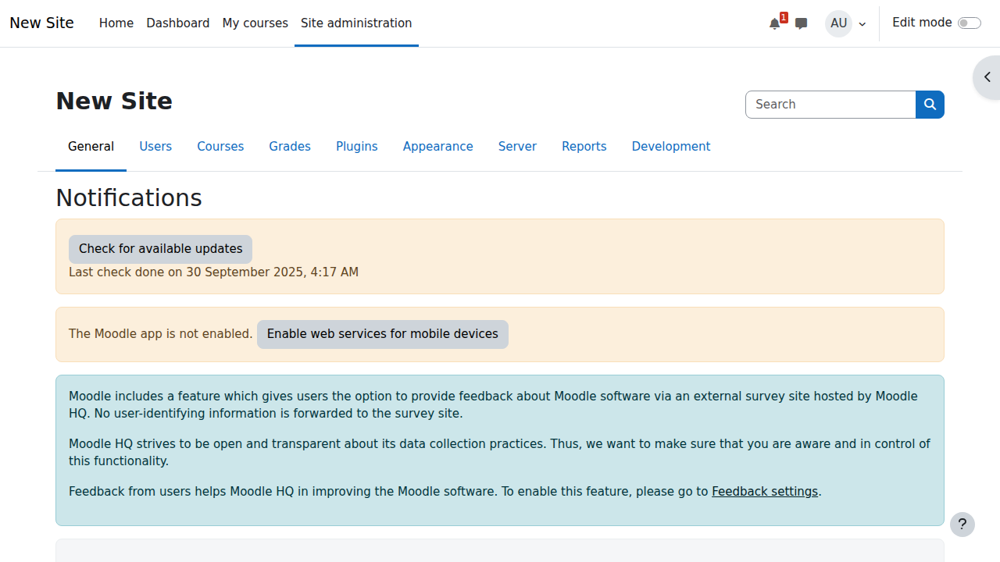
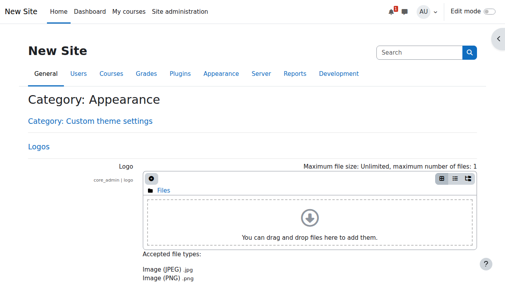

# Bab 4: Administrasi Moodle

Setelah berhasil menginstal Moodle, langkah selanjutnya adalah melakukan konfigurasi dan administrasi sistem. Pada bab ini, kita akan mempelajari berbagai aspek administrasi Moodle mulai dari konfigurasi dasar hingga pengaturan lanjutan.

## Pengenalan `Site Administration`

`Site Administration` adalah pusat kontrol untuk mengatur seluruh aspek sistem Moodle. Hanya pengguna dengan `role` `Administrator` yang memiliki akses penuh ke area ini.

### Mengakses `Site Administration`

1. `Login` sebagai `Administrator`
2. Klik **Site administration** di `sidebar` kiri
3. Atau akses melalui menu pengguna → **Site administration**


## Konfigurasi Dasar Situs

### 1. Pengaturan Situs

#### Pengaturan Umum
1. Navigasi ke **Site administration** → **General** → **Basic settings**
2. Konfigurasi pengaturan utama:
    - **Site name**: Nama situs yang akan muncul di `title bar`
    - **Site description**: Deskripsi singkat tentang situs
    - **Front page summary**: Teks yang muncul di halaman depan
    - **Maximum upload file size**: Ukuran maksimum `file` yang bisa diunggah


**Pengaturan Penting:**
```
Site name: Moodle Learning Platform
Site description: Platform pembelajaran online untuk institusi pendidikan
Front page summary: Selamat datang di platform pembelajaran online kami
Maximum upload file size: 50MB (atau sesuai kebutuhan)
```

#### Pengaturan Halaman Depan
1. Buka **Site administration** → **Front page** → **Front page settings**
2. Konfigurasi:
    - **Front page**: Pilih `layout` halaman depan
    - **Include a topic section**: Aktifkan jika ingin `section` konten
    - **News items to show**: Jumlah berita yang ditampilkan
    - **Course summary**: Tampilkan ringkasan `course`


### 2. Pengaturan Bahasa

#### Bahasa Default
1. Navigasi ke **Site administration** → **Language** → **Language settings**
2. Atur:
    - **Default language**: Bahasa default sistem (ID untuk Indonesia)
    - **Display language menu**: Tampilkan menu pemilihan bahasa
    - **Cache language menu**: `Cache` menu bahasa untuk performa


#### Memasang Paket Bahasa
1. Buka **Site administration** → **Language** → **Language packs**
2. Pilih bahasa tambahan dari `dropdown`
3. Klik **Install selected language pack(s)**

Paket bahasa yang disarankan:
- **Indonesian (id)** - Bahasa Indonesia
- **English (en)** - Bahasa default


### 3. Pengaturan Lokasi

1. Navigasi ke **Site administration** → **Location** → **Location settings**
2. Konfigurasi:
    - **Default timezone**: Asia/Jakarta untuk Indonesia
    - **Force timezone**: Paksa semua pengguna menggunakan `timezone` ini
    - **Default country**: Indonesia


## Manajemen Pengguna

### 1. Metode Otentikasi

#### Mengelola Otentikasi
1. Buka **Site administration** → **Plugins** → **Authentication** → **Manage authentication**
2. Metode yang tersedia:
    - **Email-based self-registration**: Pengguna mendaftar sendiri melalui email
    - **Manual accounts**: Admin membuat akun secara manual
    - **LDAP server**: Integrasi dengan LDAP
    - **External database**: Database eksternal


**Pengaturan yang Disarankan:**

- Aktifkan **Email-based self-registration** untuk `course` publik
- Aktifkan **Manual accounts** untuk kontrol penuh admin
- Nonaktifkan yang tidak perlu untuk keamanan

#### Pengaturan `Email-based Self-registration`
1. Klik **Settings** pada `Email-based self-registration`
2. Konfigurasi:
    - **Require email confirmation**: Ya, untuk verifikasi email
    - **Default role**: `Student` (`role` default untuk pengguna baru)
    - **Auth instructions**: Instruksi untuk pengguna


### 2. Kebijakan Pengguna

1. Navigasi ke **Site administration** → **Users** → **Permissions** → **User policies**
2. Pengaturan penting:
    - **Guest login button**: Tampilkan tombol `login` tamu
    - **Alternate login URL**: URL `login` alternatif
    - **Forgotten password URL**: URL `reset password`
    - **Maximum time to edit posts**: Waktu maksimal untuk mengedit `post`


### 3. Penetapan Role Default

1. Buka **Site administration** → **Users** → **Permissions** → **Global roles**
2. Atur `role` default:
    - **Default role for all users**: `Authenticated user`
    - **Guest role**: `Guest`
    - **Default frontpage role**: `Frontpage`

## Keamanan Situs

### 1. Pengaturan Keamanan

#### Kebijakan Keamanan Situs
1. Navigasi ke **Site administration** → **Security** → **Site security settings**
2. Pengaturan penting:
    - **Open to Google**: Izinkan `indexing` Google
    - **Force users to login**: Paksa `login` untuk akses konten
    - **Force users to login for profiles**: Paksa `login` untuk lihat profil
    - **Protect usernames**: Sembunyikan `username` dari publik


**Konfigurasi Keamanan yang Disarankan:**
```
Open to Google: No (untuk pembelajaran pribadi)
Force users to login: Yes
Force users to login for profiles: Yes
Protect usernames: Yes
Maximum session time: 8 jam
```

#### Keamanan HTTP
1. Buka **Site administration** → **Security** → **HTTP security**
2. Konfigurasi:
    - **Use HTTPS for logins**: Ya, untuk `login` aman
    - **Cookie secure**: Aktifkan jika menggunakan HTTPS
    - **Cookie same site**: `Lax` untuk kompatibilitas


### 2. IP Blocker

1. Navigasi ke **Site administration** → **Security** → **IP blocker**
2. Tambah rentang IP yang diblokir:
    - Format: `192.168.1.0/24` untuk memblokir `subnet`
    - Format: `192.168.1.100` untuk memblokir IP spesifik
3. Tambah rentang IP yang diizinkan jika diperlukan


### 3. Notifikasi

1. Buka **Site administration** → **Security** → **Notifications**
2. Tinjau notifikasi keamanan
3. Ambil tindakan untuk masalah yang ditemukan

Notifikasi keamanan umum:
- **Unsecured dataroot**: Pastikan `dataroot` tidak dapat diakses melalui web
- **Display errors**: Nonaktifkan tampilan `error` di `production`
- **Password policy**: Atur kebijakan `password` yang kuat



## Tampilan dan Tema

### 1. Pengaturan Tema

#### Memilih Tema
1. Navigasi ke **Site administration** → **Appearance** → **Themes** → **Theme selector**
2. Pilih `theme` untuk berbagai jenis perangkat:
    - **Default theme**: `Theme` utama untuk `desktop`
    - **Mobile theme**: `Theme` untuk perangkat `mobile`
    - **Tablet theme**: `Theme` untuk `tablet`

Tema populer:
- **Boost**: `Theme` responsif modern (disarankan)
- **Classic**: Tampilan Moodle tradisional
- **More**: `Theme` dengan `sidebar` yang dapat dikustomisasi


#### Pengaturan Tema
1. Buka **Site administration** → **Appearance** → **Themes** → **Boost** (atau `theme` yang dipilih)
2. Kustomisasi:
    - **Preset**: `Preset` skema warna
    - **Brand color**: Warna utama `brand`
    - **Advanced settings**: CSS Kustom


### 2. Manajemen dan Instalasi Tema

#### Memasang Tema Baru

##### Metode 1: Instal dari Direktori `Plugin` Moodle
1. Navigasi ke **Site administration** → **Plugins** → **Install plugins**
2. Cari `theme` yang diinginkan
3. Klik **Install now**
4. Ikuti `wizard` instalasi
5. Aktifkan `theme` di `Theme selector`

##### Metode 2: Instalasi Manual
1. Unduh `theme` dari sumber terpercaya
2. Ekstrak `file` `theme`
3. Unggah ke `folder` `/theme/` di instalasi Moodle
4. Navigasi ke **Site administration** → **Notifications**
5. Selesaikan proses instalasi
6. Aktifkan `theme` di `Theme selector`

##### Metode 3: Instal melalui Docker (untuk pengaturan Docker)
```bash
# Masuk ke container
docker compose exec moodle bash

# Navigasi ke direktori theme
cd /bitnami/moodle/theme

# Unduh theme (contoh: Moove theme)
wget https://github.com/willianmano/moodle-theme_moove/archive/refs/heads/master.zip
unzip master.zip
mv moodle-theme_moove-master moove

# Atur izin
chown -R bitnami:root moove
chmod -R 755 moove

# Keluar dari container
exit
```

Setelah instalasi, kunjungi **Site administration** → **Notifications** untuk menyelesaikan instalasi.

#### Beralih Tema
1. Buka **Site administration** → **Appearance** → **Themes** → **Theme selector**
2. Klik **Change theme** pada jenis perangkat yang diinginkan
3. Pratinjau `theme` yang tersedia
4. Klik **Use theme** untuk `theme` yang dipilih
5. Simpan perubahan



### 3. Tema Moodle Gratis

#### Tema Gratis Berkualitas Premium

##### 1. **Moove**
- **URL**: https://moodle.org/plugins/theme_moove
- **Fitur**:
  - Desain modern dan bersih
  - Sepenuhnya responsif
  - Halaman `login` kustom
  - Bagian pemasaran
  - Integrasi media sosial
- **Terbaik untuk**: Universitas dan institusi pendidikan
- **Unduh**: https://github.com/willianmano/moodle-theme_moove

##### 2. **Eguru**
- **URL**: https://moodle.org/plugins/theme_eguru
- **Fitur**:
  - Tampilan profesional
  - Beberapa skema warna
  - `Slider` kustom
  - `Spot` pemasaran
  - Bagian tautan cepat
- **Terbaik untuk**: Pelatihan perusahaan dan `platform` `e-learning`
- **Unduh**: https://github.com/ProjetoSophiaDev/eguru4

##### 3. **Academi**
- **URL**: https://moodle.org/plugins/theme_academi
- **Fitur**:
  - Berbasis Bootstrap 4
  - Beberapa `layout`
  - `Blok` kustom
  - Desain responsif
  - Dukungan RTL
- **Terbaik untuk**: Institusi akademik
- **Unduh**: Dari direktori `plugin` Moodle

##### 4. **Lambda**
- **URL**: https://moodle.org/plugins/theme_lambda
- **Fitur**:
  - Sangat dapat disesuaikan
  - Beberapa `layout`
  - Ikon media sosial
  - `Footer` kustom
  - Dukungan `slideshow`
- **Terbaik untuk**: Situs pendidikan serba guna
- **Unduh**: https://github.com/bmbrands/moodle-theme_lambda

##### 5. **Fordson**
- **URL**: https://moodle.org/plugins/theme_fordson
- **Fitur**:
  - Navigasi yang disempurnakan
  - Navigasi ikon
  - `Preset` kustom
  - `Ubin` pemasaran
  - Peningkatan pencarian `course`
- **Terbaik untuk**: Sekolah K-12
- **Unduh**: https://github.com/dbnschools/moodle-theme_fordson

##### 6. **Adaptable**
- **URL**: https://moodle.org/plugins/theme_adaptable
- **Fitur**:
  - Sangat fleksibel
  - Beberapa wilayah
  - CSS/JS Kustom
  - Sistem peringatan
  - Integrasi analitik
- **Terbaik untuk**: Pengguna tingkat lanjut yang membutuhkan kustomisasi
- **Unduh**: https://gitlab.com/jezhops/moodle-theme_adaptable

##### 7. **Trema**
- **URL**: https://moodle.org/plugins/theme_trema
- **Fitur**:
  - Desain modern yang bersih
  - Dukungan mode gelap
  - Halaman depan kustom
  - Kustomisasi latar belakang `login`
  - Ikon sosial
- **Terbaik untuk**: `Platform` pendidikan modern
- **Unduh**: https://github.com/trema-tech/moodle-theme_trema

##### 8. **Edumy**
- **URL**: https://moodle.org/plugins/theme_edumy
- **Fitur**:
  - Gaya `marketplace`
  - Kartu `course`
  - Pencarian lanjutan
  - Profil instruktur
  - Galeri responsif
- **Terbaik untuk**: `Marketplace` `course` `online`
- **Unduh**: Dari direktori `plugin` Moodle

##### 9. **Klass**
- **URL**: https://moodle.org/plugins/theme_klass
- **Fitur**:
  - Sederhana dan bersih
  - Pemuatan cepat
  - `Layout` `grid`
  - `Blok` kustom
  - Ramah `mobile`
- **Terbaik untuk**: Pendekatan minimalis
- **Unduh**: Dari direktori `plugin` Moodle

##### 10. **Essential**
- **URL**: https://moodle.org/plugins/theme_essential
- **Fitur**:
  - Pengaturan komprehensif
  - `Spot` pemasaran
  - Analitik
  - Jejaring sosial
  - Dokumentasi yang luas
- **Terbaik untuk**: Instalasi kaya fitur
- **Unduh**: https://github.com/gjbarnard/moodle-theme_essential

#### Tabel Perbandingan Tema

| Tema | Terbaik Untuk | Kustomisasi | Kinerja | Dukungan Seluler | Fitur Khusus |
|---|---|---|---|---|---|
| Moove | Universitas | Tinggi | Baik | Luar Biasa | Bagian pemasaran |
| Eguru | Korporat | Sedang | Baik | Baik | Tampilan profesional |
| Academi | Akademik | Tinggi | Baik | Luar Biasa | Bootstrap 4 |
| Lambda | Umum | Sangat Tinggi | Sedang | Baik | Beberapa `layout` |
| Fordson | K-12 | Tinggi | Baik | Luar Biasa | Navigasi ikon |
| Adaptable | Lanjutan | Sangat Tinggi | Sedang | Baik | Siap analitik |
| Trema | Modern | Sedang | Luar Biasa | Luar Biasa | Mode gelap |
| Edumy | `Marketplace` | Tinggi | Baik | Luar Biasa | Kartu `course` |
| Klass | Minimalis | Rendah | Luar Biasa | Baik | Desain sederhana |
| Essential | Kaya fitur | Sangat Tinggi | Sedang | Baik | Komprehensif |

### 4. Kustomisasi Tema

#### Kustomisasi Dasar
1. Navigasi ke halaman pengaturan `theme`
2. Opsi kustomisasi umum:
    - **Logo**: Unggah logo institusi
    - **Favicon**: Ikon kecil untuk `tab` `browser`
    - **Colors**: Warna primer, sekunder, aksen
    - **Fonts**: Pengaturan tipografi
    - **Layout**: Posisi `sidebar`, pengaturan lebar

#### Kustomisasi Lanjutan

##### CSS Kustom
1. Buka pengaturan `theme` → `Advanced settings`
2. Tambahkan kode CSS kustom:
```css
/* Contoh: Mengubah warna primer */
.navbar-light {
    background-color: #2c3e50 !important;
}

/* Contoh: Gaya kartu `course` kustom */
.course-card {
    border-radius: 10px;
    box-shadow: 0 2px 4px rgba(0,0,0,0.1);
}

/* Contoh: Sembunyikan elemen tertentu */
.hidden-element {
    display: none !important;
}
```

##### JavaScript Kustom
1. Tambahkan di pengaturan `Additional HTML`
2. Contoh kustomisasi:
```javascript
// Tambahkan fungsionalitas kustom
document.addEventListener('DOMContentLoaded', function() {
    // Kode kustom di sini
});
```

### 5. Sumber Daya Pengembangan Tema

#### Dokumentasi dan Tutorial
- **Official Moodle Theme Development**: https://docs.moodle.org/dev/Themes
- **Theme Development Tutorial**: https://docs.moodle.org/dev/Creating_a_theme
- **Bootstrap in Moodle**: https://docs.moodle.org/dev/Bootstrap
- **Mustache Templates**: https://docs.moodle.org/dev/Templates

#### Alat Pengembangan
- **Theme Designer Mode**: Aktifkan untuk pengembangan yang lebih mudah
- **Theme Debugger**: Untuk pemecahan masalah
- **Cache Purge**: Bersihkan `cache` `theme` saat pengembangan

#### Sumber Daya Komunitas
- **Moodle Themes Forum**: https://moodle.org/mod/forum/view.php?id=46
- **GitHub Repositories**: Cari "moodle theme" untuk contoh
- **Moodle Partners**: Layanan pengembangan `theme` profesional

### 6. Praktik Terbaik untuk Manajemen Tema

#### Kriteria Pemilihan
1. **Kompatibilitas**: Pastikan kompatibel dengan versi Moodle
2. **Responsif**: Uji di berbagai perangkat
3. **Kinerja**: Periksa kecepatan muat
4. **Aksesibilitas**: Kepatuhan WCAG
5. **Dukungan**: Pengembangan aktif dan komunitas

#### Proses Pengujian
1. **Instal di lingkungan pengujian terlebih dahulu**
2. **Uji dengan `browser` yang berbeda**
3. **Periksa responsivitas `mobile`**
4. **Verifikasi semua fungsi berfungsi**
5. **Uji dengan konten nyata**

#### Kiat Pemeliharaan
1. **Pembaruan Rutin**: Selalu perbarui `theme`
2. **Cadangkan Sebelum Perubahan**: Selalu cadangkan
3. **Dokumentasikan Kustomisasi**: Lacak perubahan yang dibuat
4. **Pantau Kinerja**: Periksa dampak pada waktu muat
5. **Umpan Balik Pengguna**: Kumpulkan dan tanggapi umpan balik

### 7. Pemecahan Masalah Tema

#### Masalah Umum dan Solusinya

**Masalah: `Theme` tidak muncul setelah instalasi**
- Solusi: Bersihkan semua `cache`
- Periksa izin `file`
- Verifikasi jalur instalasi benar

**Masalah: `Layout` rusak setelah beralih `theme`**
- Solusi: Bersihkan `cache` `theme`
- Atur ulang pengaturan `theme`
- Periksa CSS kustom yang bertentangan

**Masalah: Kinerja lambat dengan `theme` baru**
- Solusi: Optimalkan gambar
- Minimalkan CSS/JS kustom
- Aktifkan `caching` `theme`
- Periksa sumber daya yang berat

**Masalah: Masalah tampilan `mobile`**
- Solusi: Periksa pengaturan responsif
- Uji dengan perangkat nyata
- Verifikasi pengaturan `theme` `mobile`
- Perbarui `theme` ke versi terbaru

### 8. Navigasi

1. Navigasi ke **Site administration** → **Appearance** → **Navigation**
2. Konfigurasi:
    - **Default home page**: Halaman `default` setelah `login`
    - **Include categories in nav**: Sertakan kategori `course` di navigasi
    - **Sort my courses**: Urutan `course` di navigasi


### 9. Pengaturan HTML

1. Buka **Site administration** → **Appearance** → **Additional HTML**
2. Tambahkan HTML/CSS/JavaScript kustom:
    - **Within HEAD**: Kode di dalam `tag` `head`
    - **When BODY is opened**: Kode setelah `tag` `body` pembuka
    - **Before BODY is closed**: Kode sebelum `tag` `body` penutup


## Manajemen `Course`

### 1. Pengaturan Default `Course`

1. Navigasi ke **Site administration** → **Courses** → **Course default settings**
2. Konfigurasi `default` untuk `course` baru:
    - **Course format**: Format `course` `default` (`Topics`, `Weekly`, dll)
    - **Maximum upload size**: Ukuran unggah per `course`
    - **Show gradebook to students**: Tampilkan `gradebook` ke `students`
    - **Show activity completion**: Tampilkan pelacakan penyelesaian aktivitas


### 2. Permintaan `Course`

1. Buka **Site administration** → **Courses** → **Course request**
2. Aktifkan permintaan `course` jika ingin pengguna bisa meminta `course` baru
3. Atur kategori `default` untuk permintaan `course`
4. Konfigurasi pengaturan notifikasi


### 3. Pengaturan Cadangan

#### Cadangan Otomatis
1. Navigasi ke **Site administration** → **Courses** → **Backups** → **Automated backup setup**
2. Konfigurasi:
    - **Active**: Aktifkan pencadangan otomatis
    - **Days of week**: Hari untuk pencadangan otomatis
    - **Execution time**: Waktu eksekusi pencadangan
    - **Save to**: Lokasi penyimpanan cadangan


**Pengaturan Cadangan yang Disarankan:**
```
Active: Yes
Days of week: Harian (atau sesuai kebutuhan)
Execution time: 02:00 (jam 2 pagi)
Save to: Sistem `file` dan lokasi eksternal
Keep: 7 cadangan (1 minggu)
```

## Manajemen `Plugin`

### 1. Ikhtisar `Plugin`

1. Buka **Site administration** → **Plugins** → **Plugins overview**
2. Lihat semua `plugin` yang terpasang
3. Periksa pembaruan
4. Aktifkan/nonaktifkan `plugin` sesuai kebutuhan


### 2. Instal `Plugin`

#### Memasang dari Direktori Moodle
1. Navigasi ke **Site administration** → **Plugins** → **Install plugins**
2. Cari `plugin` di direktori `plugin` Moodle
3. Klik **Install** untuk `plugin` yang diinginkan
4. Ikuti `wizard` instalasi

#### Instalasi `Plugin` Manual
1. Unduh `plugin` dari sumbernya
2. Ekstrak ke direktori yang sesuai:
    - `/path/to/moodle/[plugintype]/[pluginname]`
3. Kunjungi **Site administration** → **Notifications**
4. Selesaikan proses instalasi


### 3. `Plugin` Populer

**`Plugin` yang Disarankan:**

- **BigBlueButton**: Konferensi video
- **H5P**: Konten interaktif
- **Plagiarism detection**: Alat anti-plagiarisme
- **Mobile app**: Dukungan aplikasi `mobile` resmi Moodle
- **Zoom**: Integrasi rapat Zoom

## Pemantauan Sistem

### 1. Informasi Sistem

1. Navigasi ke **Site administration** → **Server** → **System information**
2. Tinjau:
    - **Moodle version**: Versi Moodle yang digunakan
    - **Database**: Informasi `database`
    - **PHP version**: Versi PHP
    - **Web server**: Informasi `web server`


### 2. Lingkungan

1. Buka **Site administration** → **Server** → **Environment**
2. Periksa kepatuhan persyaratan sistem
3. Tinjau rekomendasi
4. Perbaiki masalah yang ditemukan


### 3. Info PHP

1. Navigasi ke **Site administration** → **Server** → **PHP info**
2. Tinjau konfigurasi PHP
3. Periksa ekstensi yang dimuat
4. Verifikasi pengaturan penting

Pengaturan PHP penting untuk Moodle:
- `memory_limit`: 512M atau lebih
- `max_execution_time`: 300 atau lebih
- `post_max_size`: 50M atau sesuai kebutuhan
- `upload_max_filesize`: 50M atau sesuai kebutuhan


## Optimasi Kinerja

### 1. `Caching`

#### Konfigurasi `Cache` Umum
1. Buka **Site administration** → **Plugins** → **Caching** → **Configuration**
2. Konfigurasi `cache stores`:
    - **File**: `Cache` `file` `default`
    - **Session**: `Cache` sesi
    - **Static**: `Cache` statis untuk performa


#### Kinerja `Cache`
1. Navigasi ke **Site administration** → **Plugins** → **Caching** → **Test performance**
2. Jalankan tes kinerja untuk `cache stores` yang berbeda
3. Optimalkan berdasarkan hasil tes

### 2. Optimasi `Database`

1. Buka **Site administration** → **Server** → **Tasks** → **Database transfer**
2. Pemeliharaan rutin:
    - Periksa pertumbuhan ukuran `database`
    - Jalankan optimasi `database`
    - Pantau `query` yang lambat

### 3. Manajemen `File`

1. Navigasi ke **Site administration** → **Server** → **File management**
2. Tinjau:
    - **File storage**: Total penggunaan penyimpanan `file`
    - **Temp files**: Pembersihan `file` sementara
    - **Backup files**: Manajemen `file` cadangan


## Mode Pemeliharaan

### 1. Aktifkan Mode Pemeliharaan

1. Buka **Site administration** → **Server** → **Maintenance mode**
2. Aktifkan untuk pemeliharaan:
    - **Enable maintenance mode**: `Yes`
    - **Maintenance message**: Pesan untuk pengguna
    - **Additional information**: Info tambahan


Gunakan `maintenance mode` untuk:
- Pembaruan sistem
- Pemeliharaan `database`
- Instalasi/pembaruan `plugin`
- Migrasi sistem

### 2. Pemeliharaan CLI

Alternatif melalui baris perintah:
```bash
# Aktifkan mode pemeliharaan
docker compose exec moodle php admin/cli/maintenance.php --enable

# Nonaktifkan mode pemeliharaan
docker compose exec moodle php admin/cli/maintenance.php --disable
```

## Pemecahan Masalah Umum

### 1. Masalah Kinerja

**Gejala:**

- Pemuatan halaman lambat
- Beban `server` tinggi
- `Timeout` `database`

**Solusi:**
1. Aktifkan `caching`
2. Optimalkan `database`
3. Tingkatkan `memory limit` PHP
4. Gunakan CDN untuk `file` statis

### 2. Masalah `Login`

**Gejala:**

- Tidak bisa `login`
- Sesi cepat berakhir
- `Loop` pengalihan

**Solusi:**
1. Periksa pengaturan sesi
2. Verifikasi koneksi `database`
3. Bersihkan `cache` `browser`
4. Periksa pengaturan otentikasi

### 3. Masalah Unggah

**Gejala:**

- Tidak bisa mengunggah `file`
- Kesalahan ukuran `file`
- Izin ditolak

**Solusi:**
1. Periksa pengaturan unggah PHP
2. Verifikasi izin `folder`
3. Tingkatkan batas unggah
4. Periksa ruang `disk`

## Praktik Terbaik

### 1. Praktik Terbaik Keamanan

1. **Pembaruan Rutin**
    - Perbarui Moodle secara berkala
    - Perbarui `plugin`
    - Pantau notifikasi keamanan

2. **Otentikasi Kuat**
    - Terapkan `password` yang kuat
    - Aktifkan otentikasi dua faktor
    - Audit rutin akun pengguna

3. **Kontrol Akses**
    - Prinsip hak istimewa terendah
    - Tinjau `role` pengguna secara teratur
    - Pantau aktivitas admin

### 2. Praktik Terbaik Kinerja

1. **Strategi `Caching`**
    - Aktifkan `caching` yang sesuai
    - Gunakan `cache stores` eksternal
    - Pantau kinerja `cache`

2. **Optimasi `Database`**
    - Pemeliharaan `database` rutin
    - Pantau kinerja `query`
    - Optimalkan konfigurasi `database`

3. **Manajemen `File`**
    - Pembersihan rutin `file` sementara
    - Pantau penggunaan `disk`
    - Terapkan kebijakan retensi `file`

### 3. Praktik Terbaik Pencadangan

1. **Pencadangan Rutin**
    - Pencadangan otomatis harian
    - Pencadangan sistem penuh mingguan
    - Uji prosedur pemulihan

2. **Beberapa Lokasi Cadangan**
    - Penyimpanan cadangan lokal
    - Penyimpanan cadangan jarak jauh
    - Solusi pencadangan `cloud`

3. **Verifikasi Cadangan**
    - Pengujian pemulihan rutin
    - Verifikasi integritas cadangan
    - Dokumentasikan prosedur pemulihan

## Kesimpulan

Administrasi Moodle yang baik memerlukan pemahaman mendalam tentang berbagai aspek sistem. Poin-poin penting yang perlu diingat:

1. **Konfigurasi Situs**: Pengaturan yang tepat dari awal sangat penting
2. **Keamanan**: Implementasi kebijakan keamanan yang ketat
3. **Kinerja**: Pemantauan dan optimasi berkelanjutan
4. **Pemeliharaan**: Pemeliharaan dan pembaruan rutin
5. **Pencadangan**: Strategi pencadangan yang kuat

Dengan mengikuti praktik terbaik di atas, sistem Moodle Anda akan berjalan optimal, aman, dan andal untuk mendukung kegiatan pembelajaran.

---

**Kiat Administrasi:**

- Dokumentasikan semua konfigurasi yang dilakukan
- Pantau kinerja sistem secara berkala
- Cadangkan sebelum melakukan perubahan besar
- Uji di lingkungan pengembangan terlebih dahulu
- Selalu ikuti perkembangan komunitas Moodle

**Berikutnya:** [Bab 5 - Manajemen Pengguna dan Role →](pengguna-dan-role.md)