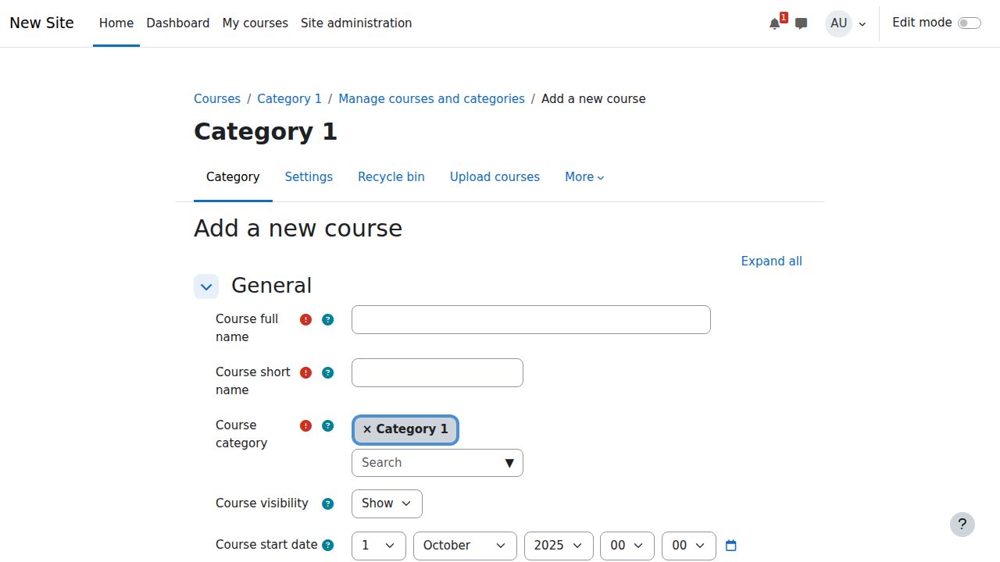
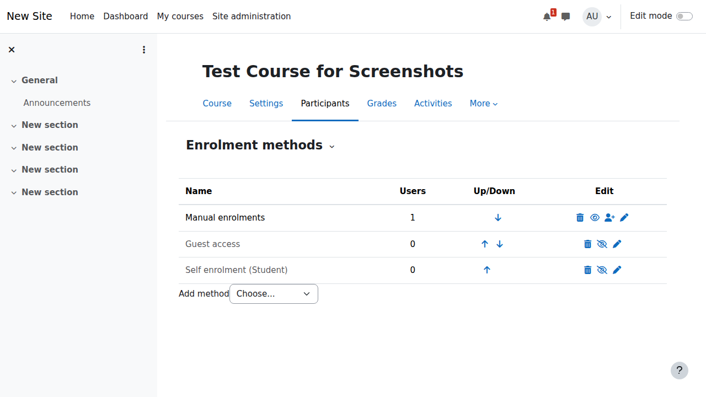

# Bab 6: Manajemen `Course`

Setelah memahami manajemen pengguna dan `role`, langkah selanjutnya adalah membuat dan mengelola `course` (kursus) di Moodle. Bab ini akan membahas semua aspek penting dari manajemen `course`.

## Pengenalan Manajemen `Course`

### Apa itu `Course` di Moodle?

`Course` di Moodle adalah ruang `online` di mana pengajar dan siswa dapat berinteraksi. Ini berisi semua materi pembelajaran, aktivitas, dan alat penilaian.

### Format `Course`

Moodle menawarkan beberapa format `course`:
- **`Topics format`**: Konten diatur berdasarkan topik.
- **`Weekly format`**: Konten diatur berdasarkan minggu.
- **`Social format`**: Berpusat pada satu `forum` utama.
- **`Single activity format`**: Hanya berisi satu aktivitas atau sumber daya.

## Langkah 1: Membuat `Course` Baru

### Navigasi ke Pembuatan `Course`

1. Buka **`Site administration`** → **`Courses`** → **`Add a new course`**.

### Mengisi Detail `Course`

**Informasi Umum:**
- **`Course full name`**: Nama lengkap `course`.
- **`Course short name`**: Nama pendek untuk navigasi.
- **`Course category`**: Kategori di mana `course` akan ditempatkan.
- **`Course visibility`**: Apakah `course` terlihat oleh siswa atau tidak.
- **`Course start date`**: Tanggal mulai `course`.
- **`Course end date`**: Tanggal akhir `course` (opsional).

**Deskripsi:**
- **`Course summary`**: Deskripsi singkat tentang `course`.
- **`Course image`**: Gambar yang mewakili `course`.

### Pengaturan `Course`

- **`Course format`**: Pilih format yang diinginkan (`Topics`, `Weekly`, dll.).
- **`Appearance`**: Pengaturan tampilan, seperti bahasa dan jumlah pengumuman.
- **`Files and uploads`**: Batas ukuran `file` yang dapat diunggah.
- **`Completion tracking`**: Aktifkan pelacakan penyelesaian aktivitas.

## Langkah 2: Mengelola Konten `Course`

### Menambah Aktivitas

Aktivitas adalah komponen interaktif dari `course` Anda.

1. Masuk ke halaman `course`.
2. Aktifkan **`Edit mode`**.
3. Klik **`Add an activity or resource`**.
4. Pilih aktivitas yang diinginkan:
   - **`Assignment`**: Tugas yang dapat dinilai.
   - **`Quiz`**: Kuis dengan berbagai jenis pertanyaan.
   - **`Forum`**: `Forum` diskusi.
   - **`Glossary`**: Kumpulan istilah dan definisi.
   - **`Lesson`**: Materi pembelajaran interaktif.
   - **`SCORM package`**: Paket konten standar `e-learning`.

### Menambah Sumber Daya

Sumber daya adalah konten yang dapat dilihat atau diunduh oleh siswa.

1. Aktifkan **`Edit mode`**.
2. Klik **`Add an activity or resource`**.
3. Pilih sumber daya yang diinginkan:
   - **`File`**: Unggah `file` (PDF, Word, dll.).
   - **`URL`**: Tautan ke situs web eksternal.
   - **`Page`**: Halaman web yang dibuat di dalam Moodle.
   - **`Book`**: Kumpulan halaman yang terstruktur.
   - **`Folder`**: `Folder` yang berisi beberapa `file`.

### Mengatur Konten

- Gunakan **`sections`** (topik atau minggu) untuk mengelompokkan konten.
- Gunakan **`labels`** untuk menambahkan teks atau gambar di antara aktivitas.
- **Seret dan lepas** untuk mengatur ulang urutan konten.

## Langkah 3: Metode Pendaftaran

### Pendaftaran Manual

1. Buka `course`.
2. Klik **`Participants`** di menu navigasi `course`.
3. Klik **`Enrol users`**.
4. Cari pengguna dan tetapkan `role` (misalnya, `Student`).

### Pendaftaran Mandiri (`Self-enrolment`)

1. Buka **`Course administration`** → **`Users`** → **`Enrolment methods`**.
2. Aktifkan **`Self enrolment`**.
3. Atur **`enrolment key`** (opsional) untuk membatasi akses.

### Sinkronisasi `Cohort`

1. Buat `cohort` (grup pengguna tingkat situs) di **`Site administration`**.
2. Di **`Enrolment methods`**, tambahkan **`Cohort sync`**.
3. Pilih `cohort` yang akan didaftarkan ke `course`.

## Langkah 4: Penilaian

### `Gradebook`

`Gradebook` adalah tempat semua nilai untuk `course` dikumpulkan.

1. Buka `course`.
2. Klik **`Grades`** di menu navigasi `course`.
3. Di **`Gradebook setup`**, Anda dapat:
   - Mengatur bobot untuk setiap item penilaian.
   - Membuat kategori nilai.
   - Mengatur skala nilai.

### Menilai Tugas

1. Buka aktivitas **`Assignment`**.
2. Klik **`View all submissions`**.
3. Klik **`Grade`** untuk setiap siswa.
4. Berikan nilai, umpan balik, dan `file` anotasi.

### Penilaian Kuis

- Pertanyaan pilihan ganda dan tipe objektif lainnya dinilai secara otomatis.
- Pertanyaan esai perlu dinilai secara manual.

## Praktik Terbaik untuk Manajemen `Course`

- **Desain yang Jelas**: Atur konten secara logis dan mudah dinavigasi.
- **Interaksi**: Gunakan `forum` dan aktivitas lain untuk mendorong interaksi.
- **Umpan Balik**: Berikan umpan balik yang teratur dan konstruktif.
- **Pelacakan Kemajuan**: Gunakan `activity completion` untuk membantu siswa melacak kemajuan mereka.

## Kesimpulan

Manajemen `course` yang efektif adalah inti dari pengalaman belajar di Moodle. Dengan membuat `course` yang terstruktur dengan baik, menambahkan aktivitas yang menarik, dan memberikan penilaian yang adil, Anda dapat menciptakan lingkungan belajar `online` yang sukses.

---

**Berikutnya:** [Bab 7 - `Backup` dan `Restore` →](backup-restore.md)
