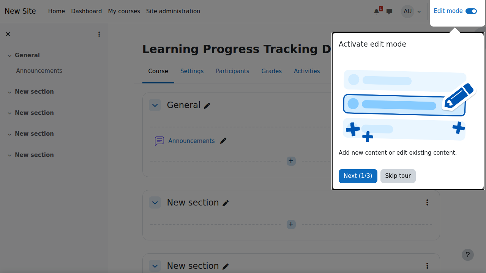

# Bab 12: Learning Progress Tracking

Learning Progress Tracking adalah salah satu fitur paling powerful di Moodle yang memungkinkan instructor dan administrator untuk memantau, menganalisis, dan meningkatkan efektivitas pembelajaran. Bab ini akan membahas secara komprehensif implementasi tracking, analisis, dan optimasi pembelajaran di Moodle.

## ⚠️ PENTING: Tentang LRS (Learning Record Store)

**Progress tracking standard di Moodle TIDAK memerlukan LRS atau aplikasi tambahan!**

### Apa yang TIDAK Perlu LRS:
✅ **Activity Completion** - Built-in Moodle
✅ **Course Completion** - Built-in Moodle
✅ **Gradebook Tracking** - Built-in Moodle
✅ **Standard Reports** - Built-in Moodle
✅ **SCORM 1.2/2004** - Built-in Moodle
✅ **H5P Content** - Built-in Moodle

### Apa yang PERLU LRS:
❌ **CMI5 Packages** - Memerlukan LRS (dijelaskan di Bab 10)
❌ **xAPI Content** - Memerlukan LRS (dijelaskan di Bab 10)
❌ **TinCan API Content** - Memerlukan LRS (dijelaskan di Bab 10)

**Bab ini fokus pada fitur built-in Moodle yang dapat langsung digunakan tanpa setup tambahan.**

---

## Pengenalan Learning Progress Tracking

### Apa itu Learning Progress Tracking?

**Learning Progress Tracking** adalah sistem monitoring dan analisis kemajuan pembelajaran siswa melalui berbagai metrik dan indikator. Di Moodle, ini mencakup:

- **Activity Completion**: Penyelesaian aktivitas individual
- **Course Completion**: Penyelesaian keseluruhan course
- **Grade Progress**: Perkembangan nilai dan penilaian
- **Engagement Metrics**: Tingkat keterlibatan siswa
- **Time Tracking**: Waktu yang dihabiskan untuk belajar

### Manfaat Learning Progress Tracking

1. **Untuk Instructor**: Identifikasi siswa yang membutuhkan bantuan
2. **Untuk Siswa**: Self-monitoring dan motivasi
3. **Untuk Administrator**: Evaluasi efektivitas program
4. **Untuk Institution**: Data-driven decision making

## Komponen Learning Progress Tracking di Moodle

### 1. Activity Completion

**Types of Completion Conditions:**

- **Manual marking**: Instructor tandai sebagai complete
- **View requirement**: Siswa harus melihat konten
- **Grade requirement**: Perlu nilai minimum
- **Date requirement**: Harus selesai sebelum tanggal tertentu

**Setup Activity Completion:**

1. Buka **Course administration** → **Edit settings**
2. Aktifkan **Enable completion tracking**
3. Untuk setiap aktivitas, atur completion conditions:
   - **Completion tracking**: Pilih jenis tracking
   - **Require view**: Centang jika perlu dilihat
   - **Require grade**: Set nilai minimum
   - **Expect completed on**: Set deadline



### 2. Course Completion

**Course Completion Criteria:**

- **Activity completion**: Selesaikan aktivitas tertentu
- **Grade completion**: Capai nilai akhir tertentu
- **Duration**: Habiskan waktu minimum
- **Enrollment duration**: Selesai dalam batas waktu

**Setup Course Completion:**

1. **Course administration** → **Course completion**
2. Atur kriteria penyelesaian:
   - **Condition type**: Pilih kriteria
   - **Aggregation**: Cara menghitung completion
   - **Bulk activity completion**: Atur untuk semua aktivitas

### 3. Gradebook Tracking

**Gradebook Features:**

- **Categories**: Pengelompokan item penilaian
- **Weights**: Bobot untuk setiap kategori
- **Calculations**: Formula perhitungan nilai
- **Scales**: Skala penilaian kustom

**Gradebook Setup:**

1. **Grades** → **Setup** → **Gradebook setup**
2. Buat kategori dengan weights
3. Atur aggregation method (Sum of grades, Weighted mean, etc.)
4. Set grade items dan calculations

## Advanced Tracking Techniques

### 1. Conditional Activities

**What are Conditional Activities:**
Aktivitas yang hanya tersedia setelah kondisi tertentu terpenuhi.

**Types of Conditions:**

- **Grade condition**: Butuh nilai minimum di aktivitas lain
- **Activity completion**: Harus selesaikan aktivitas tertentu
- **Date condition**: Hanya tersedia di tanggal tertentu
- **User profile condition**: Berdasarkan atribut user
- **Restriction set**: Kombinasi beberapa kondisi

**Implementation:**

```markdown
Contoh Conditional Path:
1. Video Introduction (Prerequisite)
2. Quiz (Must pass with 80%)
3. Assignment (Available after quiz passed)
4. Discussion Forum (Available after assignment submitted)
5. Final Project (Available after all above completed)
```

### 2. Competency-Based Education (CBE)

**What is Competency-Based Education:**
Pendekatan pembelajaran yang fokus pada penguasaan kompetensi spesifik.

**Moodle Competency Framework:**

- **Competency Frameworks**: Struktur kompetensi
- **Competencies**: Kemampuan spesifik yang harus dikuasai
- **Proficiency Scales**: Tingkat penguasaan
- **Learning Plans**: Rencana pembelajaran personal

**Setup Competencies:**

1. **Site administration** → **Competencies** → **Competency frameworks**
2. Buat framework dan kompetencies
3. Hubungkan dengan course dan aktivitas
4. Atur proficiency scales

### 3. Learning Analytics

**Moodle Learning Analytics:**

- **Reports**: Berbagai jenis laporan analitik
- **Insights**: Rekomendasi otomatis
- **Models**: Model prediktif
- **Notifications**: Notifikasi otomatis

**Types of Analytics:**

- **Engagement analytics**: Tingkat partisipasi
- **Performance analytics**: Prestasi akademik
- **Progress analytics**: Kemajuan pembelajaran
- **Behavioral analytics**: Pola perilaku belajar

## Implementation Strategies

### 1. Progressive Learning Path

**Design Principles:**

- **Logical sequencing**: Urutan pembelajaran yang logis
- **Mastery learning**: Harus kuasai sebelum lanjut
- **Scaffolding**: Dukungan bertahap
- **Feedback loops**: Umpan balik kontinu

**Example Implementation:**

```markdown
Week 1: Foundation Concepts
├── Reading: Basic Principles
├── Video: Introduction
├── Quiz: Basic Understanding (Pass: 70%)
└── Discussion: Initial Thoughts

Week 2: Intermediate Application
├── Case Study: Real-world Application
├── Assignment: Problem Solving
├── Peer Review: Feedback Exchange
└── Reflection: Learning Journal

Week 3: Advanced Mastery
├── Project: Complex Application
├── Presentation: Demonstrate Mastery
├── Final Assessment: Comprehensive Evaluation
└── Certification: Competency Verification
```

### 2. Personalized Learning Paths

**Adaptive Learning Elements:**

- **Diagnostic assessments**: Identifikasi kebutuhan
- **Personalized recommendations**: Konten yang disesuaikan
- **Variable pacing**: Kecepatan belajar personal
- **Multiple pathways**: Berbagai rute pembelajaran

**Implementation in Moodle:**

1. **Diagnostic pre-test**: Identifikasi starting point
2. **Branching scenarios**: Berdasarkan hasil pre-test
3. **Adaptive content**: Konten yang disesuaikan
4. **Dynamic assessments**: Tes yang beradaptasi

### 3. Gamification Elements

**Gamification in Tracking:**

- **Points and badges**: Sistem reward
- **Progress bars**: Visual progress indication
- **Leaderboards**: Kompetisi sehat
- **Achievement unlocks**: Milestone recognition

**Moodle Implementation:**

- **Badges**: Digital certificates
- **Restrict access**: Unlock content
- **Custom certificates**: Completion rewards
- **Level indicators**: Progress visualization

## Data Analysis and Reporting

### 1. Built-in Moodle Reports

**Course Reports:**

- **Activity report**: Log aktivitas
- **Course participation**: Partisipasi siswa
- **Activity completion**: Status penyelesaian
- **Grade history**: Riwayat nilai

**Student Reports:**

- **User report**: Aktivitas individual
- **Today's logs**: Log harian
- **All live logs**: Log real-time
- **Activity completion**: Progress personal

### 2. Custom Reports (Built-in)

**Standard Moodle Reports:**

Moodle menyediakan berbagai report built-in tanpa perlu plugin tambahan:

**Course Reports:**

- **Activity report**: Aktivitas per student
- **Course participation**: Partisipasi course
- **Activity completion**: Status completion
- **Course completion**: Overall course progress

**Admin Reports:**

- **Logs**: System logs
- **Live logs**: Real-time activity
- **Statistics**: Usage statistics
- **Grades**: Grade reports

### 3. Custom Reports (Optional Plugin)

**Configurable Reports Plugin** (Opsional - jika perlu custom queries):

- **Custom SQL queries**: Query database kustom
- **Scheduled reports**: Laporan otomatis
- **Export options**: Various formats
- **Dashboard integration**: Visual display

> **Note:** Plugin ini opsional. Standard reports Moodle sudah cukup untuk mayoritas kebutuhan.

**Report Examples:**

```sql
-- Students at risk (low activity + poor grades)
SELECT u.username, u.firstname, u.lastname,
       COUNT(DISTINCT l.id) as activity_count,
       AVG(g.finalgrade) as average_grade
FROM mdl_user u
LEFT JOIN mdl_logstore_standard_log l ON u.id = l.userid
LEFT JOIN mdl_grade_items gi ON gi.courseid = [COURSE_ID]
LEFT JOIN mdl_grade_grades g ON g.itemid = gi.id AND g.userid = u.id
WHERE u.id IN (
    SELECT DISTINCT userid FROM mdl_user_enrolments
    WHERE enrolid IN (
        SELECT id FROM mdl_enrol WHERE courseid = [COURSE_ID]
    )
)
GROUP BY u.id
HAVING activity_count < 5 OR average_grade < 60
```

### 4. External Analytics Tools (Optional - Advanced)

> **Note:** Tools ini **opsional** dan hanya untuk kebutuhan enterprise/advanced analytics. Standard Moodle reports sudah mencakup semua kebutuhan dasar progress tracking.

**Integration Options:**

- **Google Analytics**: Web analytics (track page views, user behavior)
- **Power BI**: Business intelligence (advanced dashboards, enterprise reporting)
- **Tableau**: Data visualization (interactive charts, executive dashboards)
- **Custom dashboards**: Real-time monitoring (untuk large-scale deployments)

**Kapan Perlu External Tools:**

- Enterprise deployment (>10,000 users)
- Cross-platform analytics (multiple LMS systems)
- Executive dashboards untuk C-level
- Advanced predictive analytics

**Untuk mayoritas use case, built-in Moodle reports sudah cukup.**

## Best Practices

### 1. Data Collection Strategy

**What to Track:**

- **Completion rates**: Tingkat penyelesaian
- **Time metrics**: Waktu pembelajaran
- **Performance indicators**: Indikator prestasi
- **Engagement metrics**: Tingkat keterlibatan
- **Behavioral patterns**: Pola perilaku

**Data Collection Methods:**

- **Automatic tracking**: System-generated data
- **Manual entry**: Instructor input
- **Self-reporting**: Student input
- **Integration data**: External systems

### 2. Privacy and Ethics

**Privacy Considerations:**

- **FERPA compliance**: Perlindungan data edukasi
- **GDPR compliance**: Regulasi data EU
- **Informed consent**: Persetujuan pengguna
- **Data retention**: Kebijakan penyimpanan data

**Ethical Use of Data:**

- **Transparent communication**: Jelaskan penggunaan data
- **Student empowerment**: Berikan akses ke data mereka
- **Beneficial use**: Gunakan data untuk improvement
- **Avoid discrimination**: Hindari bias dalam analisis

### 3. Actionable Insights

**From Data to Action:**

- **Identify patterns**: Temukan pola perilaku
- **Early intervention**: Deteksi masalah early
- **Personalized support**: Bantuan yang disesuaikan
- **Course improvement**: Perbaikan konten

**Intervention Strategies:**

- **Automated notifications**: Notifikasi otomatis
- **Personalized messages**: Pesan personal
- **Resource recommendations**: Rekomendasi sumber daya
- **Instructor alerts**: Alert untuk instructor

## Advanced Features

### 1. Predictive Analytics

**Predictive Models:**

- **At-risk prediction**: Identifikasi siswa berisiko
- **Performance prediction**: Prediksi prestasi
- **Dropout prediction**: Prediksi putus sekolah
- **Success probability**: Probabilitas keberhasilan

**Implementation:**

- **Machine learning**: Algoritma ML
- **Historical data**: Data historis
- **Real-time processing**: Proses real-time
- **Model validation**: Validasi model

### 2. Real-time Monitoring

**Real-time Dashboards:**

- **Live activity monitoring**: Monitoring aktivitas live
- **Real-time alerts**: Alert real-time
- **Interactive visualizations**: Visualisasi interaktif
- **Mobile access**: Akses mobile

**Use Cases:**

- **Proctoring**: Monitoring during exams
- **Live sessions**: Real-time engagement
- **Emergency response**: Response cepat
- **Support requests**: Bantuan real-time

### 3. Integration with External Systems

**HRIS Integration:**

- **Employee data**: Data karyawan
- **Training records**: Record training
- **Performance data**: Data performa
- **Compliance tracking**: Tracking compliance

**CRM Integration:**

- **Student information**: Informasi siswa
- **Communication history**: Riwayat komunikasi
- **Support tickets**: Ticket support
- **Marketing data**: Data marketing

## Case Studies

### 1. Corporate Training Implementation

**Company:** TechCorp Global
**Challenge:** Training compliance untuk 5,000+ karyawan
**Solution:** Implementasi comprehensive tracking system

**Results:**

- 95% completion rate (dari 60%)
- 40% reduction in training time
- Real-time compliance reporting
- Automated certificate generation

**Key Features:**

- Automated enrollment
- Progress dashboards
- Manager notifications
- Integration with HR system

### 2. Higher Education Implementation

**University:** State University
**Challenge:** Improving student retention
**Solution:** Early warning system with predictive analytics

**Results:**

- 25% improvement in retention
- 30% increase in student satisfaction
- Better resource allocation
- Improved advisor effectiveness

**Key Features:**

- Predictive risk modeling
- Automated intervention
- Student success dashboard
- Advisor alert system

## Troubleshooting

### 1. Common Issues

**Tracking Not Working:**

- **Symptom:** Progress tidak tercatat
- **Solution:** Check completion settings, user roles, permissions

**Data Inconsistency:**

- **Symptom:** Data tidak akurat
- **Solution:** Database maintenance, data validation

**Performance Issues:**

- **Symptom:** System lambat
- **Solution:** Database optimization, caching, server upgrade

### 2. Technical Solutions

**Database Optimization:**

- **Indexing**: Improve query performance
- **Caching**: Reduce database load
- **Archiving**: Move old data to archive
- **Partitioning**: Split large tables

**System Maintenance:**

- **Regular backups**: Automated backup system
- **Updates**: Keep system updated
- **Monitoring**: System health monitoring
- **Security**: Regular security audits

## Future Trends

### 1. AI and Machine Learning

**AI-Powered Analytics:**

- **Personalized learning paths**: Adaptive learning
- **Intelligent tutoring**: Smart tutoring systems
- **Automated content generation**: AI content creation
- **Emotional analysis**: Sentiment analysis

### 2. Blockchain Integration

**Blockchain Credentials:**

- **Verifiable credentials**: Tamper-proof certificates
- **Micro-credentials**: Small skill certifications
- **Lifetime learning records**: Permanent learning records
- **Cross-institution verification**: Easy verification

### 3. Internet of Things (IoT)

**IoT Learning Analytics:**

- **Wearable devices**: Biometric data
- **Smart classrooms**: Environmental data
- **VR/AR tracking**: Immersive learning data
- **Real-world integration**: Physical world data

## Kesimpulan

Learning Progress Tracking di Moodle menawarkan kemampuan powerful untuk monitoring, analisis, dan optimasi pembelajaran. Dengan implementasi yang tepat, Anda dapat:

- Meningkatkan engagement siswa
- Mengidentifikasi siswa yang membutuhkan bantuan
- Mengoptimalkan efektivitas pembelajaran
- Membuat keputusan data-driven
- Memberikan pengalaman pembelajaran personal

Dengan mengikuti best practices dan memanfaatkan fitur-fitur advanced yang dijelaskan dalam bab ini, Anda dapat membuat sistem tracking yang komprehensif dan efektif untuk institution Anda.

---

**Berikutnya:** [Bab 10 - Weakness Analysis dan Improvement →](weakness-analysis.md)

**Sebelumnya:** [Bab 8 - SCORM dan Standar E-Learning →](scorm-dan-standar.md)