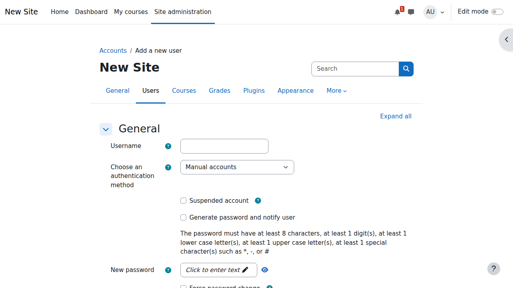
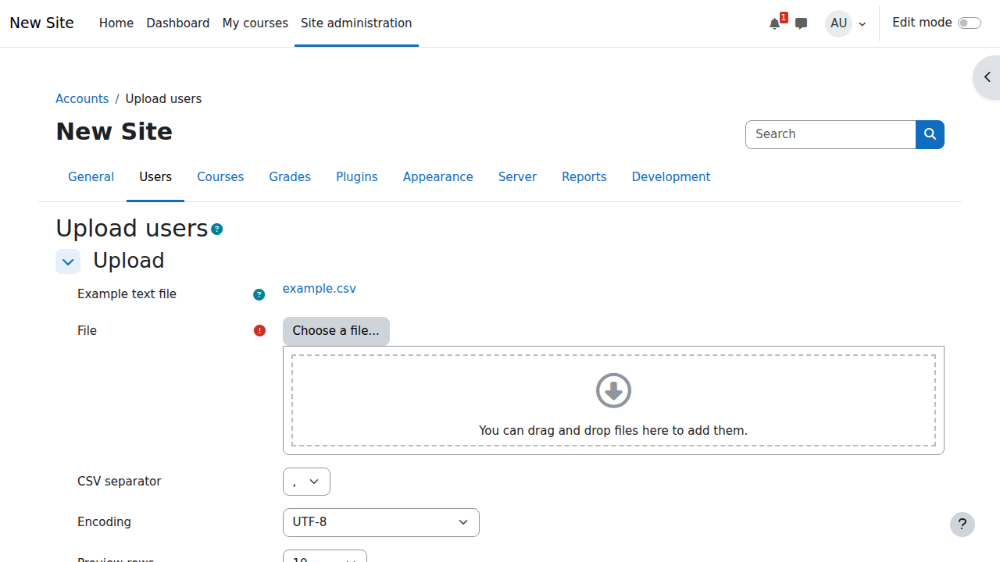
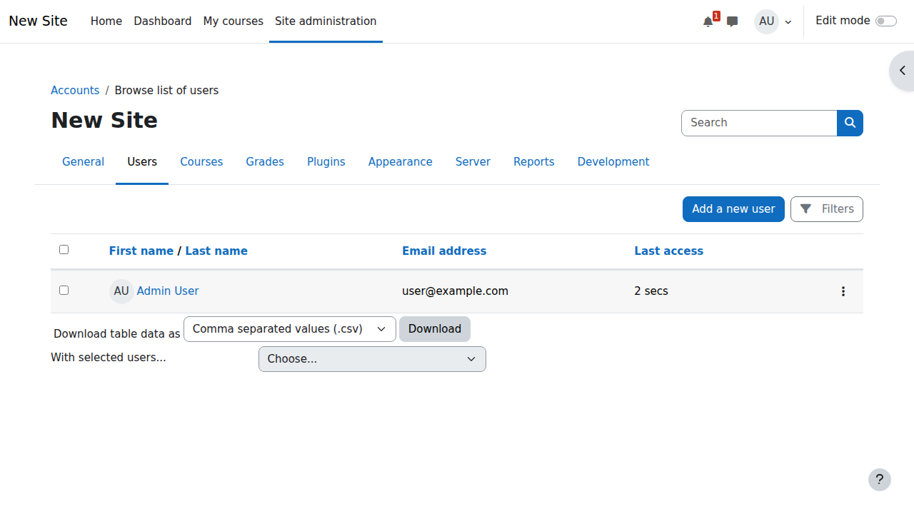
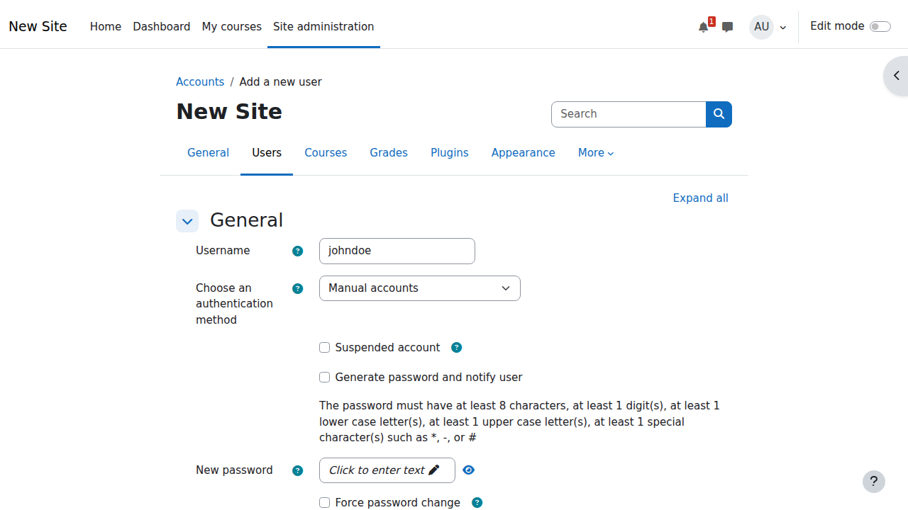
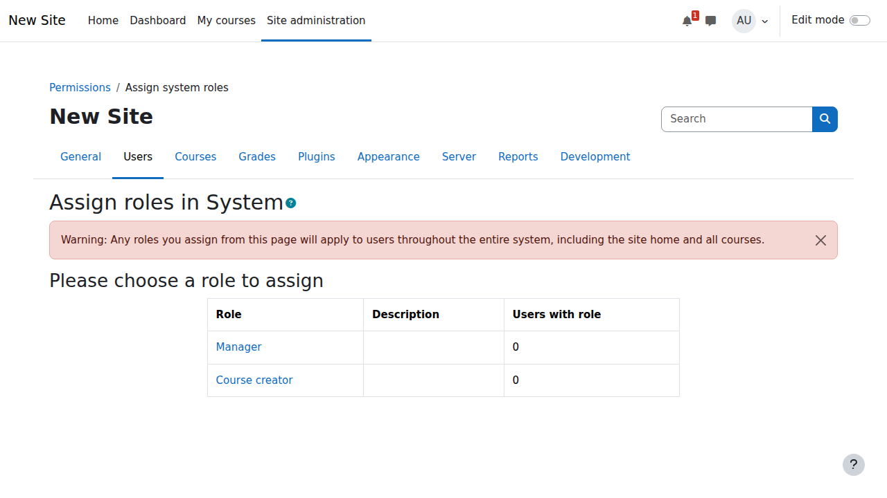
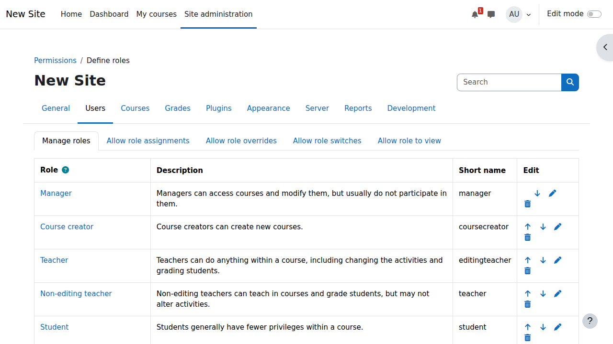
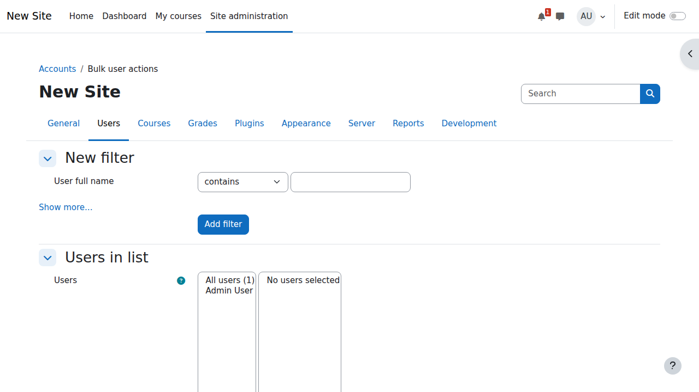
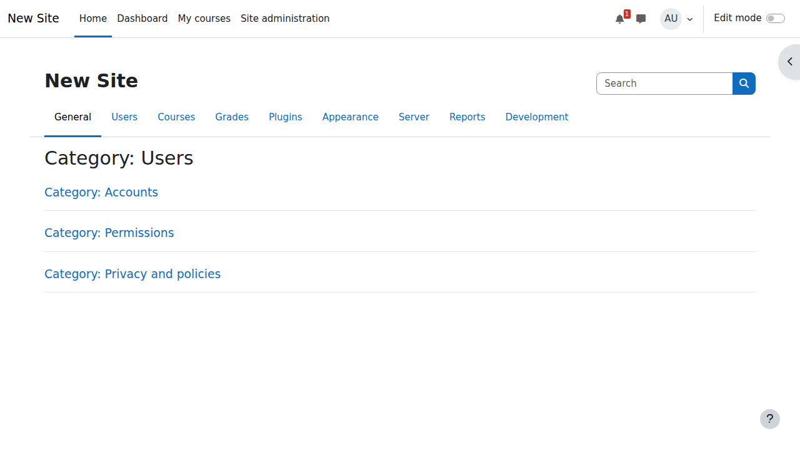
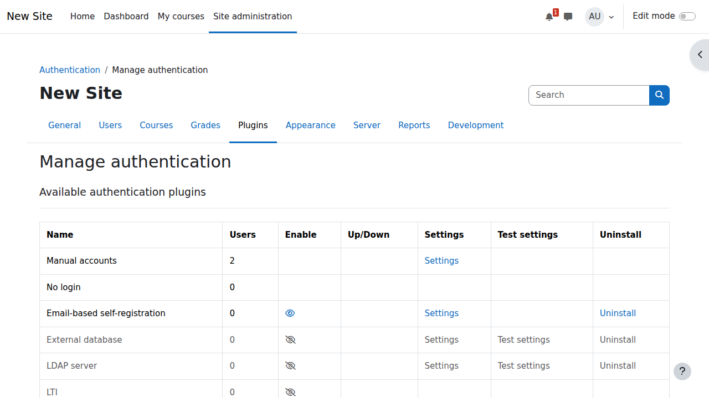
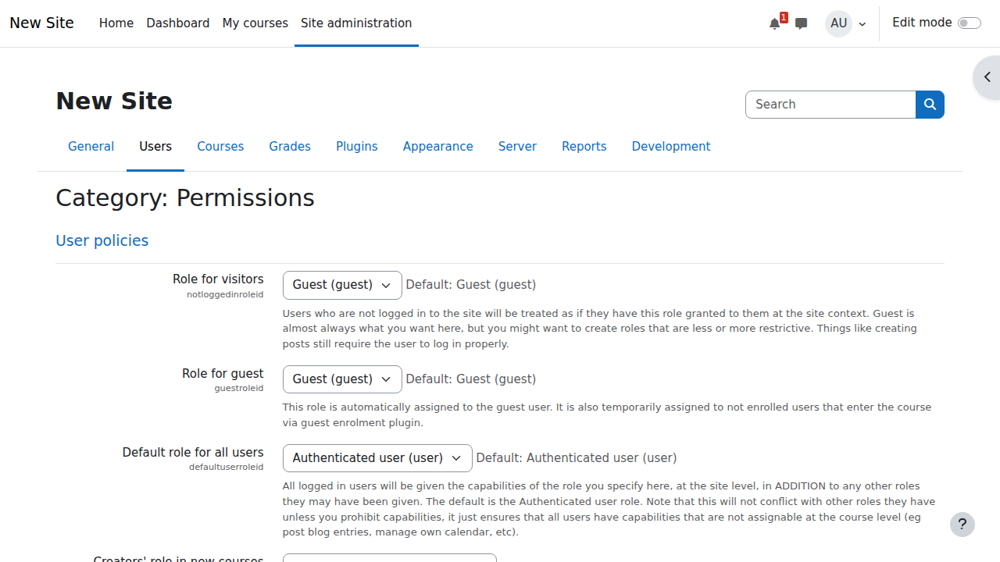

# Bab 5: Manajemen Pengguna dan Role

Moodle menggunakan sistem role-based access control (RBAC) yang fleksibel untuk mengatur hak akses pengguna. Pada bab ini, kita akan mempelajari berbagai role yang tersedia di Moodle, cara mengelola pengguna, dan mengkonfigurasi permission sesuai kebutuhan institusi.

## Manajemen Pengguna

### Membuat Pengguna Baru

#### Metode 1: Pembuatan Pengguna Manual

1. **Login sebagai Administrator**
   - Akses Moodle dengan akun administrator.
   - Navigasi ke `Site Administration`.

2. **Akses Manajemen Pengguna**
   - Buka: **Site administration** → **Users** → **Add a new user**.
   - Atau akses URL langsung: `/user/editadvanced.php?id=-1`.

3. **Isi Kolom yang Diperlukan**

   **Informasi Umum:**
   - **Username**: Pengenal unik untuk login (huruf kecil, tanpa spasi).
   - **Authentication method**: `Manual accounts` (default) atau otentikasi eksternal.
   - **New password**: Minimal 8 karakter dengan kombinasi huruf, angka, dan simbol.
   - **First name**: Nama depan pengguna.
   - **Surname**: Nama belakang pengguna.
   - **Email address**: Email yang valid untuk notifikasi.

   **Kolom Tambahan:**
   - **Email display**: Kontrol siapa yang bisa melihat email.
   - **City/town**: Lokasi pengguna.
   - **Country**: Pilih dari dropdown.
   - **Timezone**: Zona waktu lokal pengguna.
   - **Preferred language**: Bahasa antarmuka untuk pengguna.
   - **Description**: Bio atau informasi opsional.

4. **Pengaturan Opsional**
   - **Force password change**: Wajibkan pengguna untuk mengubah password saat login pertama.
   - **Generate password and notify user**: Sistem membuat password dan mengirimkannya ke email pengguna.
   - **User picture**: Unggah foto profil.
   - **Interests**: Tag untuk minat pengguna.

5. **Buat Pengguna**
   - Klik tombol "Create user".
   - Pengguna akan langsung aktif dan dapat login.



#### Metode 2: Unggah Pengguna Massal via CSV

1. **Siapkan File CSV**

   Format CSV dengan header:
   ```csv
   username,password,firstname,lastname,email,city,country,auth
   john.doe,Pass@word123,John,Doe,john@example.com,Jakarta,ID,manual
   jane.smith,Secure#456,Jane,Smith,jane@example.com,Bandung,ID,manual
   ```

   **Kolom yang diperlukan:**
   - username
   - firstname
   - lastname
   - email

   **Kolom opsional:**
   - password (jika tidak ada, akan dibuat otomatis)
   - auth (metode otentikasi, default: manual)
   - idnumber (ID eksternal)
   - institution
   - department
   - phone1, phone2
   - address
   - lang (bahasa pilihan)
   - timezone
   - course1 (untuk pendaftaran otomatis)
   - role1 (peran dalam course1)

2. **Proses Unggah**
   - Navigasi ke: **Site administration** → **Users** → **Upload users**
   - Pilih file CSV
   - Pilih `delimiter` (koma, titik koma, atau tab)
   - Konfigurasi `encoding` (disarankan UTF-8)

3. **Pratinjau dan Pengaturan**
   - Tinjau kolom yang terdeteksi
   - Petakan kolom CSV ke kolom Moodle
   - Atur jenis unggah:
     - **Add new only**: Lewati pengguna yang sudah ada
     - **Add new and update existing**: Perbarui jika nama pengguna sudah ada
     - **Update existing only**: Hanya perbarui pengguna yang sudah ada

4. **Pengaturan Pembuatan Pengguna**
   - **New user password**:
     - Kolom yang diperlukan dalam file
     - Buat password jika perlu
     - Hasilkan dan kirim password melalui email
   - **Force password change**: Saat login pertama
   - **Email new users**: Kirim email selamat datang

5. **Lakukan Unggah**
   - Tinjau ringkasan
   - Klik "Upload users"
   - Periksa hasil untuk kesalahan atau peringatan



#### Metode 3: Otentikasi Eksternal

**Integrasi LDAP/Active Directory:**
1. Konfigurasi plugin otentikasi LDAP
2. Petakan atribut LDAP ke kolom Moodle
3. Pengguna dibuat secara otomatis saat login pertama

**OAuth2 (Google, Microsoft, Facebook):**
1. Atur layanan OAuth2
2. Konfigurasi `client ID` dan `secret`
3. Pengguna dapat mendaftar sendiri melalui login sosial

**Otentikasi Database:**
1. Hubungkan ke database eksternal
2. Petakan kolom database
3. Sinkronkan pengguna secara berkala

### Menonaktifkan Pengguna (Suspend/Deactivate)

#### Metode 1: Menangguhkan Akun Pengguna

1. **Navigasi ke Daftar Pengguna**
   - **Site administration** → **Users** → **Browse list of users**
   - Cari pengguna yang akan ditangguhkan.

2. **Edit Profil Pengguna**
   - Klik ikon edit (roda gigi/pensil) pada baris pengguna.
   - Atau klik nama pengguna lalu "Edit profile".

3. **Tangguhkan Akun**
   - Ubah **Authentication method** menjadi "No login".
   - Ini mencegah pengguna untuk login tanpa menghapus data mereka.
   - `Courses`, `grades`, dan konten pengguna tetap tersimpan.

4. **Alternatif: Kunci Akun**
   - Di profil pengguna, atur **Suspended** menjadi "Yes".
   - Pengguna tidak bisa login tapi akun tetap aktif.
   - Berguna untuk penangguhan sementara.



#### Metode 2: Aksi Pengguna Massal

1. **Pilih Beberapa Pengguna**
   - Buka **Site administration** → **Users** → **Bulk user actions**
   - Cari dan pilih pengguna untuk ditangguhkan.
   - Tambahkan ke pilihan.

2. **Pilih Aksi**
   - Pilih "Force password change".
   - Atau "Delete" untuk penghapusan permanen.
   - Atau "Add to cohort" untuk manajemen grup.

3. **Konfirmasi Aksi**
   - Tinjau pengguna yang dipilih.
   - Konfirmasi penangguhan.

#### Metode 3: Penangguhan Otomatis

**Pembersihan Pengguna Tidak Aktif:**
1. Konfigurasi di **Site administration** → **Users** → **User policies**
2. Atur "Delete not fully setup users after" (hari)
3. Atur "Delete suspended users after" (hari)
4. Aktifkan pembersihan otomatis

**Kedaluwarsa Pendaftaran Kursus:**
1. Atur durasi pendaftaran di pengaturan kursus
2. Konfigurasi tindakan saat pendaftaran berakhir:
   - Biarkan pengguna terdaftar tetapi ditangguhkan
   - Batalkan pendaftaran pengguna dari kursus
   - Beri tahu pengguna sebelum kedaluwarsa

### Mengaktifkan Kembali Pengguna (Reactivate)

#### Mengaktifkan Kembali Akun yang Ditangguhkan

1. **Temukan Pengguna yang Ditangguhkan**
   - **Site administration** → **Users** → **Browse list of users**
   - Filter berdasarkan metode otentikasi "No login"
   - Atau cari berdasarkan nama pengguna/email

2. **Edit Profil Pengguna**
   - Klik ikon edit untuk pengguna
   - Akses pengaturan profil pengguna

3. **Pulihkan Akses**
   - Ubah **Authentication method** kembali ke "Manual accounts"
   - Atau metode otentikasi asli (LDAP, OAuth2, dll.)
   - Jika bendera `suspended` digunakan, atur **Suspended** ke "No"

4. **Setel Ulang Kata Sandi (Opsional)**
   - Buat kata sandi baru
   - Paksa perubahan kata sandi saat login berikutnya
   - Kirim email pengaturan ulang kata sandi

5. **Verifikasi Pengaktifan Kembali**
   - Periksa apakah pengguna dapat login
   - Verifikasi pendaftaran kursus masih aktif
   - Konfirmasi penetapan peran masih utuh



#### Pengaktifan Kembali Massal

1. **Menggunakan Aksi Massal**
   - Pilih beberapa pengguna yang ditangguhkan
   - Terapkan perubahan metode otentikasi
   - Kirim email notifikasi

2. **Metode Pembaruan CSV**
   ```csv
   username,auth
   john.doe,manual
   jane.smith,manual
   ```
   - Unggah dengan "Update existing only"
   - Mengubah metode otentikasi untuk pengguna yang dipilih

#### Tugas Pasca-Pengaktifan Kembali

1. **Tinjau Izin Pengguna**
   - Periksa penetapan peran
   - Verifikasi pendaftaran kursus
   - Perbarui keanggotaan grup jika perlu

2. **Komunikasi**
   - Kirim email selamat datang kembali
   - Berikan instruksi login yang diperbarui
   - Bagikan setiap perubahan sistem

3. **Pemantauan**
   - Lacak keberhasilan login
   - Pantau untuk masalah
   - Berikan dukungan jika perlu

### Praktik Terbaik Manajemen Akun Pengguna

#### Pertimbangan Keamanan

1. **Kebijakan Kata Sandi**
   - Terapkan kata sandi yang kuat (minimal 8 karakter, kombinasi huruf besar-kecil, angka, simbol)
   - Wajibkan perubahan kata sandi secara berkala
   - Cegah penggunaan kembali kata sandi
   - Kunci akun setelah beberapa kali gagal mencoba

2. **Pemantauan Akun**
   - Audit rutin akun admin
   - Pantau pola login yang tidak biasa
   - Lacak perubahan izin
   - Tinjau akun yang tidak aktif

3. **Perlindungan Data**
   - Terapkan kebijakan retensi data
   - Pembersihan rutin akun lama
   - Penyimpanan data pengguna yang aman
   - Langkah-langkah kepatuhan GDPR

#### Alur Kerja Administratif

1. **Orientasi Pengguna Baru**
   ```
   Buat Akun → Tetapkan Peran → Daftarkan ke Kursus →
   Kirim Email Selamat Datang → Pantau Login Pertama → Berikan Dukungan
   ```

2. **Manajemen Siklus Hidup Pengguna**
   ```
   Aktif → Peringatan (tidak aktif) → Ditangguhkan →
   Diarsipkan → Dihapus (setelah periode retensi)
   ```

3. **Proses Pemulihan Akun**
   ```
   Permintaan Pengguna → Verifikasi Identitas → Periksa Status Akun →
   Setel Ulang Kata Sandi → Aktifkan Kembali → Konfirmasi Akses
   ```

#### Masalah Umum dan Solusinya

**Masalah: Pengguna Tidak Bisa Login**
- Periksa metode otentikasi
- Verifikasi akun tidak ditangguhkan
- Setel ulang kata sandi jika perlu
- Periksa status konfirmasi email
- Verifikasi nama pengguna benar (case-sensitive)

**Masalah: Akun Duplikat**
- Gabungkan akun pengguna jika memungkinkan
- Hapus duplikat tanpa aktivitas
- Perbarui email untuk mencegah duplikat
- Gunakan kolom ID unik

**Masalah: Kesalahan Pembuatan Akun Massal**
- Validasi format CSV
- Periksa kolom yang diperlukan
- Verifikasi keunikan email
- Tinjau persyaratan kata sandi
- Uji dengan sejumlah kecil data terlebih dahulu

## Pengenalan Role di Moodle

### Konsep Dasar Role

Role di Moodle adalah kumpulan `permissions` (izin) yang menentukan apa yang bisa dan tidak bisa dilakukan oleh seorang pengguna di dalam sistem. Setiap pengguna dapat memiliki berbagai `role` tergantung pada `context` (lingkup) di mana mereka berada.

**Konsep Kunci:**
- **Role**: Kumpulan `capabilities` (kemampuan).
- **Context**: Lingkup di mana `role` diterapkan (`System`, `Category`, `Course`, `Activity`).
- **Capabilities**: Izin spesifik (seperti membuat kursus, menilai siswa).
- **Assignment**: Pemberian `role` kepada pengguna dalam `context` tertentu.



### Hierarki Context di Moodle

`Context` menentukan cakupan di mana `role` berlaku:

1. **System Context**: Seluruh sistem Moodle.
2. **Category Context**: Kategori `course` dan sub-kategorinya.
3. **Course Context**: `Course` tertentu.
4. **Activity/Module Context**: `Activity` atau `resource` tertentu.
5. **Block Context**: `Block` tertentu.
6. **User Context**: Profil pengguna tertentu.


## Standard Roles di Moodle

### 1. Administrator

**Cakupan**: Seluruh sistem (`System-wide`)
**Tujuan**: Kontrol penuh terhadap sistem Moodle

**Kemampuan Utama:**
- Akses ke `Site Administration`
- Instal dan kelola `plugins`
- Buat dan hapus pengguna
- Kelola pengaturan global
- Akses ke semua `courses`
- Cadangkan dan pulihkan sistem
- Kelola pengaturan keamanan

**Contoh Penggunaan Umum:**
- Administrator TI
- Manajer Sistem
- Pimpinan Dukungan Teknis

**Kemampuan Penting:**
```
moodle/site:config - Configure site settings
moodle/user:create - Create user accounts
moodle/course:create - Create courses
moodle/backup:backupsection - Backup courses
moodle/restore:restoresection - Restore courses
```



**Praktik Terbaik:**
- Batasi jumlah `Administrator` (maksimal 2-3 orang)
- Gunakan otentikasi yang kuat (disarankan 2FA)
- Audit aktivitas administrator secara rutin
- Dokumentasikan semua perubahan yang dilakukan

### 2. Manager

**Cakupan**: Tingkat `Category` atau `Course`
**Tujuan**: Mengelola `courses` dan pengguna tanpa akses ke konfigurasi sistem

**Kemampuan Utama:**
- Membuat dan mengelola `courses` dalam kategori yang ditetapkan
- Mendaftarkan dan membatalkan pendaftaran pengguna
- Akses ke laporan `course`
- Mengelola kategori `course`
- Menetapkan `roles` dalam lingkup mereka
- Melihat laporan penyelesaian `course`

**Contoh Penggunaan Umum:**
- Manajer Akademik
- Dekan atau Ketua Jurusan
- Manajer Pelatihan
- Koordinator Program

**Kemampuan Penting:**
```
moodle/course:create - Create new courses
moodle/course:delete - Delete courses
moodle/role:assign - Assign roles to users
moodle/user:viewdetails - View user profiles
moodle/course:manageactivities - Manage course activities
```


**Perbandingan Manager dan Administrator:**

| Aspek | Manager | Administrator |
|---|---|---|
| Pengaturan sistem | ❌ | ✅ |
| Manajemen plugin | ❌ | ✅ |
| Pembuatan pengguna | ✅ | ✅ |
| Manajemen `course` | ✅ | ✅ |
| Cadangan situs | ❌ | ✅ |
| Pengaturan keamanan | ❌ | ✅ |

### 3. Course Creator

**Cakupan**: Tingkat `System` atau `Category`
**Tujuan**: Membuat `courses` baru dan mengelola `courses` yang mereka buat

**Kemampuan Utama:**
- Membuat `courses` baru
- Mengelola `courses` yang mereka buat
- Mengatur pengaturan awal `course`
- Menetapkan `teachers` ke `courses` mereka
- Akses ke templat `course`

**Contoh Penggunaan Umum:**
- Guru Senior
- Pengembang Kurikulum
- Desainer Instruksional
- Ketua Jurusan

**Kemampuan Penting:**
```
moodle/course:create - Create new courses
moodle/course:update - Edit course settings
moodle/role:assign - Assign teachers to courses
moodle/course:visibility - Change course visibility
```


**Alur Kerja Course Creator:**
1. Buat `course` dengan pengaturan dasar
2. Konfigurasi format dan struktur `course`
3. Tetapkan `teachers`
4. Atur metode pendaftaran
5. Transfer kepemilikan atau pertahankan akses

### 4. Teacher (Editing Teacher)

**Cakupan**: Tingkat `Course`
**Tujuan**: Kontrol penuh di dalam `course` untuk pengajaran dan penilaian

**Kemampuan Utama:**
- Mengedit konten `course`
- Membuat dan mengelola `activities`
- Menilai `students`
- Mengelola pendaftaran `course`
- Akses ke `gradebook`
- Membuat `groups` dan `groupings`
- Mencadangkan dan memulihkan `course`

**Contoh Penggunaan Umum:**
- Instruktur Utama
- Guru Mata Pelajaran
- Pemilik `Course`
- Pelatih Utama

**Kemampuan Penting:**
```
moodle/course:manageactivities - Create/edit activities
moodle/grade:edit - Edit grades
moodle/course:enrol - Enroll students
moodle/backup:backupcourse - Backup course
moodle/restore:restorecourse - Restore course
moodle/course:update - Update course settings
```


**Tanggung Jawab Teacher:**
- **Pembuatan Konten**: Mengembangkan materi pembelajaran
- **Penilaian**: Membuat dan menilai `assignments`/`quizzes`
- **Komunikasi**: Berinteraksi dengan `students`
- **Pelacakan Kemajuan**: Memantau kemajuan `student`
- **Manajemen Course**: Menjaga organisasi `course`

### 5. Non-editing Teacher

**Cakupan**: Tingkat `Course`
**Tujuan**: Dukungan pengajaran tanpa hak `editing`

**Kemampuan Utama:**
- Melihat semua konten `course`
- Menilai `students` (`assignments` yang sudah ada)
- Berpartisipasi dalam `activities`
- Melihat laporan dan `gradebook`
- Berkomunikasi dengan `students`
- Mengunduh konten `course`

**Contoh Penggunaan Umum:**
- Asisten Pengajar
- Dosen Tamu
- Penilai
- Tutor
- Pengamat dengan hak menilai

**Kemampuan Penting:**
```
moodle/grade:edit - Edit grades (limited)
moodle/course:viewhiddenactivities - View hidden content
moodle/grade:viewall - View all grades
moodle/user:viewdetails - View student profiles
```


**Perbandingan Non-editing Teacher dan Teacher:**

| Kemampuan | Non-editing Teacher | Teacher |
|---|---|---|
| Membuat `activities` | ❌ | ✅ |
| Mengedit konten `course` | ❌ | ✅ |
| Menilai `assignments` | ✅ | ✅ |
| Melihat `gradebook` | ✅ | ✅ |
| Mendaftarkan `students` | ❌ | ✅ |
| Cadangan `course` | ❌ | ✅ |

### 6. Student

**Cakupan**: Tingkat `Course`
**Tujuan**: Belajar dan berpartisipasi dalam aktivitas `course`

**Kemampuan Utama:**
- Melihat konten `course`
- Mengirim `assignments`
- Mengerjakan `quizzes`
- Berpartisipasi dalam `forums`
- Melihat nilai sendiri
- Mengunduh `resources`
- Berpartisipasi dalam aktivitas grup

**Contoh Penggunaan Umum:**
- Pelajar
- Peserta Pelatihan
- Peserta `Course`
- Pengguna Terdaftar

**Kemampuan Penting:**
```
moodle/course:view - View course content
moodle/mod/assign:submit - Submit assignments
moodle/mod/quiz:attempt - Attempt quizzes
moodle/mod/forum:replypost - Reply in forums
moodle/grade:view - View own grades
```


**Pengalaman Student:**
- **Akses Course**: Menavigasi konten `course`
- **Partisipasi Aktivitas**: Menyelesaikan `assignments` dan `quizzes`
- **Komunikasi**: Diskusi `forum`, pesan
- **Pelacakan Kemajuan**: Melihat nilai dan penyelesaian
- **Akses Resource**: Mengunduh materi

### 7. Guest

**Cakupan**: Tingkat `System` atau `Course` (jika akses tamu diaktifkan)
**Tujuan**: Akses terbatas untuk pratinjau konten

**Kemampuan Utama:**
- Melihat konten `course` (hanya baca)
- Menjelajahi area publik
- Tidak ada kemampuan pengiriman
- Tidak ada akses nilai
- Partisipasi `forum` terbatas

**Contoh Penggunaan Umum:**
- Pratinjau `Course`
- Akses Konten Publik
- Akun Demonstrasi
- Akses Uji Coba


**Batasan Guest:**
- Tidak dapat mengirim `assignments`
- Tidak dapat mengerjakan `quizzes` yang dinilai
- Tidak dapat mengakses `gradebook`
- Tidak ada pelacakan kemajuan permanen
- Interaksi `forum` terbatas

### 8. Authenticated User

**Cakupan**: Tingkat `System` (`role` default)
**Tujuan**: Hak istimewa dasar untuk pengguna yang sudah `login`

**Kemampuan Utama:**
- Menjelajahi katalog `course`
- Melihat profil publik
- Mengakses konten halaman depan
- Menggunakan sistem pesan
- Melihat `forum` publik

**Penetapan Otomatis**: Setiap pengguna yang `login` secara otomatis mendapatkan `role` ini.


## Role Lanjutan dan Kustom

### Role Spesifik Departemen

Banyak institusi membuat `role` kustom untuk kebutuhan spesifik:

#### Academic Advisor
```
Capabilities:
- Melihat kemajuan `student` di seluruh `courses`
- Akses ke laporan penyelesaian
- Komunikasi dengan `students`
- Tampilan nilai terbatas
```

#### Librarian
```
Capabilities:
- Akses ke manajemen `resource`
- Mengunggah materi pendidikan
- Mengelola konten perpustakaan digital
- Melihat statistik penggunaan
```

#### Parent/Guardian
```
Capabilities:
- Melihat kemajuan anak
- Akses ke laporan nilai
- Komunikasi terbatas dengan `teachers`
- Tidak ada `editing` konten
```


### Membuat Role Kustom

1. **Navigasi ke Manajemen Role**
   - `Site administration` → `Users` → `Permissions` → `Define roles`
   
2. **Buat Role Baru**
   - Klik "Add a new role"
   - Pilih `archetype` (`role` dasar untuk mewarisi `capabilities`)
   - Atur nama dan deskripsi `role`

3. **Konfigurasi Capabilities**
   - Atur `permissions` untuk setiap `capability`
   - Gunakan `inheritance` atau `override`
   - Uji dengan `contexts` yang berbeda

4. **Tetapkan Role**
   - Tetapkan `role` ke pengguna dalam `context` yang sesuai
   - Pantau penggunaan dan sesuaikan `permissions`


## Penetapan dan Manajemen Role

### Penetapan Role Manual

#### Pada Tingkat Sistem
1. Navigasi ke **Site administration** → **Users** → **Permissions** → **Assign system roles**
2. Pilih `role` dari `role` yang tersedia
3. Cari dan pilih pengguna untuk ditetapkan
4. Klik "Add" untuk menetapkan `role`


#### Pada Tingkat Course
1. Buka `course`
2. Klik **Participants** dari navigasi `course`
3. Klik **Enrol users** atau **Assign roles**
4. Pilih `role` dan cari pengguna
5. Konfirmasi penetapan


#### Pada Tingkat Kategori
1. Navigasi ke kategori `course`
2. Klik **Assign roles** di pengaturan kategori
3. Pilih `role` yang sesuai
4. Tetapkan pengguna dengan `permissions` kategori spesifik

### Operasi Pengguna Massal

#### Unggah CSV
1. Siapkan file CSV dengan data pengguna dan penetapan `role`
2. Navigasi ke **Site administration** → **Users** → **Upload users**
3. Petakan kolom CSV ke kolom Moodle
4. Sertakan penetapan `role` dalam proses unggah

#### Penetapan Berbasis Cohort
1. Buat `cohorts` (grup pengguna)
2. Tetapkan `roles` ke seluruh `cohorts`
3. Gunakan pendaftaran `cohort` untuk akses `course` otomatis



### Override dan Prohibit Role

#### Override
- Mengubah `permission` dalam `context` spesifik
- `Child context` mewarisi `overrides`
- Berguna untuk `permissions` sementara

#### Prohibit
- Secara eksplisit menolak `permission`
- Tidak dapat di-`override` di `child contexts`
- Gunakan untuk batasan keamanan



## Metode Pendaftaran dan Penetapan Role

### Pendaftaran Mandiri (Self Enrollment)
- `Students` mendaftarkan diri mereka sendiri dengan `enrollment key`
- Penetapan `role` otomatis (biasanya `Student`)
- Konfigurasi tingkat `course`

### Pendaftaran Manual
- `Teachers`/`Managers` mendaftarkan pengguna secara manual
- Dapat menetapkan `role` yang berbeda selama pendaftaran
- Kontrol penuh atas siapa yang mendapatkan akses

### Sinkronisasi Cohort
- Pendaftaran otomatis berdasarkan keanggotaan `cohort`
- Sinkronkan penetapan `role`
- Berguna untuk penyebaran skala besar

### Pendaftaran Database
- Integrasi database eksternal
- Penetapan `role` otomatis berdasarkan catatan database
- Manajemen pengguna tingkat perusahaan



## Detail Sistem Izin

### Matriks Capability

Moodle menggunakan matriks `capability` untuk menentukan `permissions` akhir:

| Context | Inherit | Allow | Prevent | Prohibit | Final |
|---|---|---|---|---|---|
| System  | -       | ✅    | -       | -        | Allow |
| Course  | ✅      | -     | ❌      | -        | Prevent |
| Activity| ❌      | -     | -       | ❌       | Prohibit |

### Aturan Resolusi
1. **Prohibit** selalu menang (prioritas tertinggi)
2. **Prevent** memblokir `Allow` yang diwariskan
3. **Allow** memberikan `permission`
4. **Inherit** menggunakan `permission` dari `context` induk


### Memeriksa Izin

#### Untuk Administrator
1. Navigasi ke **Site administration** → **Users** → **Permissions** → **Check system permissions**
2. Pilih pengguna dan `context`
3. Tinjau `permissions` yang efektif
4. Identifikasi sumber `permission`

#### Laporan Izin
- Laporan `permission` pengguna
- Analisis efektivitas `role`
- Audit `capability`
- `Permissions` spesifik `context`



## Praktik Terbaik untuk Manajemen Role

### 1. Prinsip Desain Role

**Prinsip Hak Istimewa Terendah (Principle of Least Privilege)**
- Berikan `permissions` minimum yang diperlukan
- Tinjau dan bersihkan secara teratur
- Hindari akun dengan hak istimewa berlebih

**Kejelasan Role**
- Nama dan deskripsi `role` yang jelas
- Dokumentasikan tujuan `role`
- Penerapan `role` yang konsisten

**Pemisahan Tugas (Separation of Duties)**
- `Role` yang berbeda untuk fungsi yang berbeda
- Hindari tanggung jawab yang bertentangan
- Akuntabilitas yang jelas

### 2. Pertimbangan Keamanan

**Manajemen Administrator**
- Batasi akun administrator
- Gunakan otentikasi yang kuat
- Tinjauan akses secara teratur
- Pemantauan aktivitas

**Kontrol Akses Tamu**
- Nonaktifkan akses tamu jika tidak diperlukan
- Batasi `capabilities` tamu
- Pantau aktivitas tamu
- Amankan konten publik

**Audit Penetapan Role**
- Tinjauan penetapan `role` secara teratur
- Hapus penetapan yang tidak digunakan
- Pantau eskalasi hak istimewa
- Dokumentasikan perubahan `role`

### 3. Penyelarasan Organisasi

**Struktur Akademik**
- Selaraskan `roles` dengan hierarki organisasi
- Batasan tanggung jawab yang jelas
- Dukung alur kerja akademik
- `Capabilities` layanan mandiri fakultas

**Pelatihan dan Dukungan**
- Program pelatihan khusus `role`
- Dokumentasi yang jelas
- Dukungan `help desk`
- Panduan pengguna

### 4. Perencanaan Skalabilitas

**Pertimbangan Institusi Besar**
- Manajemen berbasis `cohort`
- Penetapan `role` otomatis
- Delegasi administrasi
- Optimasi kinerja

**Manajemen Pertumbuhan**
- Struktur `role` yang dapat diskalakan
- Proses otomatis
- Perencanaan sumber daya
- Pemantauan kinerja

## Skenario Role Umum

### Skenario 1: Implementasi Universitas

**Hierarki Role:**
```
System Administrator (1-2 pengguna)
├── Academic Manager (Dekan)
├── Department Manager (Ketua)
├── Course Creator (Fakultas Senior)
├── Teacher (Fakultas)
├── Teaching Assistant (Non-editing Teacher)
└── Student
```

**Role Kustom:**
- Academic Advisor
- Librarian
- External Examiner
- Parent/Guardian Access

### Skenario 2: Pelatihan Perusahaan

**Struktur Role:**
```
Training Administrator
├── Training Manager (Kepala Departemen)
├── Course Developer (Course Creator)
├── Trainer (Teacher)
├── Mentor (Non-editing Teacher)
└── Employee (Student)
```

**Role Kustom:**
- Administrator HR
- Petugas Kepatuhan
- Pelatih Eksternal
- Akses Supervisor

### Skenario 3: Institusi Pendidikan Kecil

**Struktur yang Disederhanakan:**
```
Administrator (Kepala Sekolah/TI)
├── Teacher (Semua Fakultas)
└── Student
```

**Role Tambahan:**
- Akses Orang Tua (untuk siswa yang lebih muda)
- Tamu (untuk calon siswa)


## Pemantauan dan Pelaporan

### Laporan Aktivitas Pengguna

1. **Navigasi ke Laporan**
   - `Site administration` → `Reports` → `Logs`
   - Laporan spesifik `course`
   - Pelacakan aktivitas pengguna

2. **Laporan Efektivitas Role**
   - Analisis penggunaan `permission`
   - Riwayat penetapan `role`
   - Pemantauan pola akses


### Pemantauan Kepatuhan

**Kepatuhan Perlindungan Data**
- Pelacakan persetujuan pengguna
- Pemantauan akses data
- Penegakan kebijakan retensi
- Manajemen hak privasi

**Integritas Akademik**
- Analisis pola akses
- Deteksi aktivitas tidak biasa
- Audit perubahan nilai
- Pemantauan akses konten

## Pemecahan Masalah Umum

### Masalah Izin

**Gejala:**
- Pengguna tidak dapat mengakses konten yang diharapkan
- Pesan kesalahan tentang `permissions` yang tidak mencukupi
- Item menu atau fungsi yang hilang

**Solusi:**
1. Periksa penetapan `role`
2. Verifikasi pengaturan `capability`
3. Cari `overrides`/`prohibits`
4. Uji dengan `contexts` yang berbeda

### Masalah Penetapan Role

**Gejala:**
- Pengguna diberi `role` yang salah
- Beberapa `role` yang bertentangan
- `Role` tidak berlaku

**Solusi:**
1. Tinjau proses penetapan
2. Periksa hierarki `context`
3. Bersihkan `cache` jika perlu
4. Verifikasi status pendaftaran

### Masalah Kinerja

**Gejala:**
- Penetapan `role` yang lambat
- Waktu `login` yang lama
- Kelambatan sistem dengan banyak `role`

**Solusi:**
1. Optimalkan struktur `role`
2. Gunakan penetapan berbasis `cohort`
3. Pembersihan rutin penetapan yang tidak digunakan
4. Optimasi database

## Migrasi dan Impor

### Migrasi Role Antar Situs

1. **Ekspor Definisi Role**
   - Gunakan `backup`/`restore` Moodle
   - Alat ekspor `role` kustom
   - Transfer dokumentasi

2. **Proses Impor**
   - Petakan `role` yang ada
   - Sesuaikan `capabilities`
   - Uji penetapan
   - Verifikasi `permissions`

### Impor Pengguna dengan Role

1. **Persiapan CSV**
   - Sertakan informasi `role`
   - Petakan struktur organisasi
   - Siapkan penetapan `cohort`

2. **Eksekusi Impor**
   - Uji dengan batch kecil
   - Verifikasi penetapan `role`
   - Pantau kesalahan
   - Validasi `permissions`


## Kesimpulan

Manajemen `role` yang efektif adalah kunci keberhasilan implementasi Moodle. Poin-poin penting:

1. **Memahami Sistem Role**: Pahami `capabilities`, `contexts`, dan `inheritance`.
2. **Keamanan Utama**: Terapkan `principle of least privilege` dan audit rutin.
3. **Penyelarasan Organisasi**: Desain `roles` yang sesuai dengan struktur institusi.
4. **Dokumentasi**: Pelihara dokumentasi yang jelas untuk semua `roles`.
5. **Tinjauan Rutin**: Tinjau dan bersihkan penetapan `role` secara berkala.
6. **Pelatihan**: Berikan pelatihan yang memadai untuk semua `role` pengguna.
7. **Pemantauan**: Pemantauan berkelanjutan untuk keamanan dan kinerja.

Dengan manajemen `role` yang tepat, Moodle dapat menyediakan lingkungan belajar yang aman, efisien, dan ramah pengguna untuk semua pemangku kepentingan.

---

**Pengingat Utama:**
- Selalu uji perubahan `role` di lingkungan pengembangan terlebih dahulu.
- Dokumentasikan semua `role` kustom dan modifikasinya.
- Lakukan `backup` rutin sebelum perubahan besar pada sistem `role`.
- Pantau kinerja sistem setelah modifikasi `role`.
- Jaga agar struktur `role` sesederhana mungkin sambil tetap memenuhi kebutuhan.

**Berikutnya:** [Bab 6 - Course Management →](course-management.md)