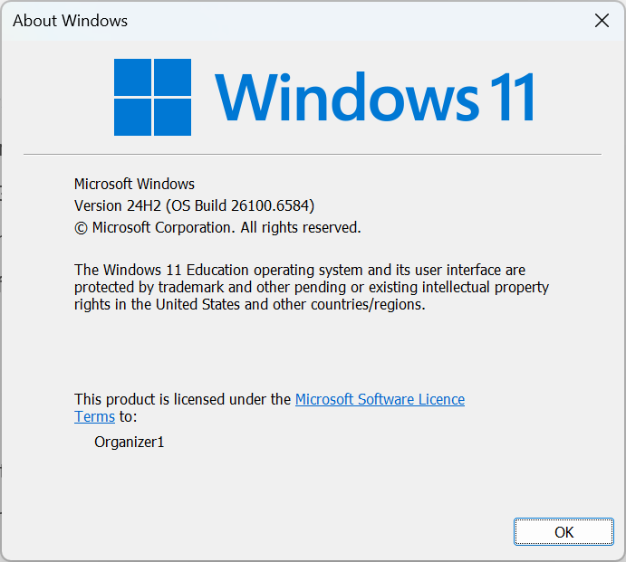
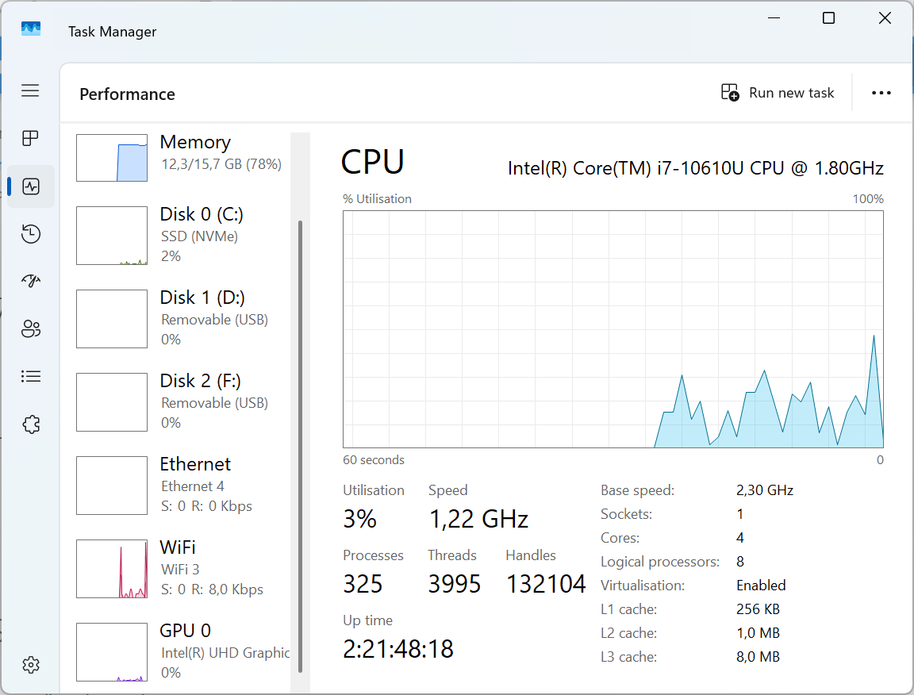
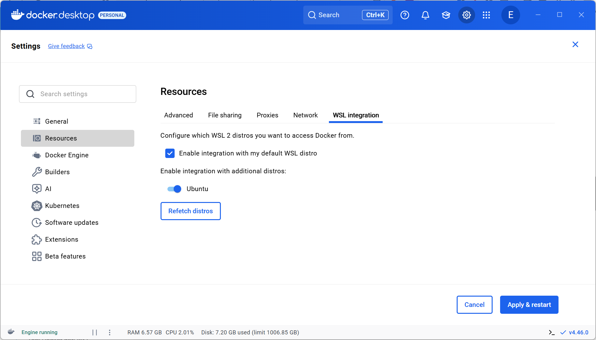

# Bab 2: Persiapan Komputer Windows

Pada bab ini, kita akan mempersiapkan komputer Windows Anda untuk menjalankan Moodle menggunakan Docker. Proses ini meliputi instalasi WSL 2 dan `Docker Desktop`.

## Persyaratan Sistem

### Persyaratan Minimum
- **Sistem Operasi**: Windows 10 versi 2004 atau lebih tinggi (Build 19041+) atau Windows 11
- **Prosesor**: Prosesor 64-bit dengan Second Level Address Translation (SLAT)
- **RAM**: 8 GB (minimum), 16 GB (disarankan)
- **Penyimpanan**: 20 GB ruang kosong
- **Virtualisasi**: Harus diaktifkan di BIOS

### Cek Versi Windows
1. Tekan `Windows + R`
2. Ketik `winver` dan tekan Enter
3. Pastikan versi Anda memenuhi persyaratan



## Langkah 1: Mengaktifkan Virtualisasi

### Cek Status Virtualisasi
1. Buka `Task Manager` (`Ctrl + Shift + Esc`)
2. Klik `tab` **Performance**
3. Pilih **CPU**
4. Lihat bagian **Virtualization** - harus **Enabled**



### Mengaktifkan Virtualisasi di BIOS
Jika Virtualisasi belum aktif:

1. **`Restart` komputer** dan masuk BIOS/UEFI
   - Dell: Tekan F2 atau F12
   - HP: Tekan F10 atau Esc
   - Lenovo: Tekan F1 atau F2
   - ASUS: Tekan F2 atau Delete

2. Cari pengaturan **Virtualization Technology** (VT-x/AMD-V)
   - Biasanya di: `Advanced` → `CPU Configuration`
   - Atau: `Security` → `Virtualization`

3. **Aktifkan** `Virtualization Technology`
4. **Simpan dan Keluar** (biasanya F10)

## Langkah 2: Instalasi WSL 2

Windows Subsystem for Linux (WSL) memungkinkan kita menjalankan `environment` Linux di Windows.

### Instal WSL 2

1. **Buka `PowerShell` sebagai `Administrator`**
   - Klik kanan `Start Menu`
   - Pilih "Windows PowerShell (Admin)"

2. **Instal WSL dengan `command` berikut:**
   ```powershell
   wsl --install
   ```

   `Command` ini akan:
   - Mengaktifkan fitur WSL
   - Mengaktifkan `Virtual Machine Platform`
   - Mengunduh dan menginstal `kernel` Linux
   - Mengatur WSL 2 sebagai `default`
   - Menginstal Ubuntu sebagai `distro` `default`

3. **`Restart` komputer** setelah instalasi selesai

### `Setup` WSL Setelah `Restart`

1. Setelah `restart`, Ubuntu akan otomatis terbuka
2. Tunggu proses instalasi selesai (beberapa menit)
3. Buat **`username`** dan **`password`** untuk Ubuntu
   
   > **Catatan:** `Password` tidak akan terlihat saat diketik (normal untuk Linux)

### Verifikasi Instalasi WSL

Buka `PowerShell` dan jalankan:
```powershell
wsl --list --verbose
```

Keluaran yang diharapkan:
```
NAME      STATE           VERSION
Ubuntu    Running         2
```

### Perbarui `Kernel` WSL (Jika Diperlukan)

Jika ada `error` tentang `kernel`:
```powershell
wsl --update
```

## Langkah 3: Instalasi `Docker Desktop`

### Unduh `Docker Desktop`

1. Kunjungi [Docker Desktop for Windows](https://www.docker.com/products/docker-desktop)
2. Klik **Download Docker Desktop**
3. Simpan `file` `installer` (sekitar 500MB)

### Instal `Docker Desktop`

1. **Klik dua kali** `Docker Desktop Installer.exe`
2. Pada halaman konfigurasi, pastikan opsi berikut **dicentang**:
   - ✅ Gunakan WSL 2 alih-alih Hyper-V
   - ✅ Tambahkan pintasan ke `desktop`

3. Klik **Ok** untuk memulai instalasi
4. Tunggu proses instalasi (5-10 menit)
5. Klik **Close and restart** untuk me-`restart` komputer

### Konfigurasi `Docker Desktop`

Setelah `restart`:

1. **`Docker Desktop` akan dimulai otomatis**
   - Jika tidak, cari "Docker Desktop" di `Start Menu`

2. **Setujui `Docker Subscription Service Agreement`**

3. **Lewati tutorial** (kita akan belajar langsung dengan praktik)

4. **Verifikasi `Backend` WSL 2**:
   - Klik ikon Docker di `system tray`
   - Pilih **Settings** (⚙️)
   - Di `tab` **General**, pastikan:
     - ✅ `Use the WSL 2 based engine`
   - Klik **Apply & restart**

### Konfigurasi `Resources`

1. Di Pengaturan `Docker Desktop`
2. Pilih **Resources** → **WSL Integration**
3. Pastikan:
   - ✅ Aktifkan integrasi dengan `distro` WSL `default` saya
   - ✅ Ubuntu (atau `distro` yang Anda instal)
4. Klik **Apply & restart**



## Langkah 4: Verifikasi Instalasi

### Tes Docker dari Windows `PowerShell`

```powershell
docker --version
docker compose version
```

Keluaran yang diharapkan:
```
Docker version 24.0.x, build xxxxx
Docker Compose version v2.x.x
```

### Tes Docker dari WSL

1. Buka Ubuntu/WSL:
   - Dari `Start Menu`, cari "Ubuntu"
   - Atau dari `PowerShell`, ketik: `wsl`

2. Tes `command` Docker:
   ```bash
   docker --version
   docker compose version
   docker run hello-world
   ```

### Tes `Docker Compose`

Buat `file` tes untuk verifikasi:

1. Di WSL/Ubuntu, buat direktori:
   ```bash
   mkdir ~/docker-test
   cd ~/docker-test
   ```

2. Buat `file` `docker-compose.yml`:
   ```bash
   cat > docker-compose.yml << EOF
   version: '3'
   services:
     web:
       image: nginx:alpine
       ports:
         - "8080:80"
   EOF
   ```

3. Jalankan `container` tes:
   ```bash
   docker compose up -d
   ```

4. Tes akses:
   - Dari WSL: `curl http://localhost:8080`
   - Dari `browser` Windows: `http://localhost:8080`

5. Hentikan dan bersihkan:
   ```bash
   docker compose down
   cd ~
   rm -rf docker-test
   ```

## Langkah 5: Instalasi Alat Tambahan (Opsional)

### Git untuk Windows

1. Unduh dari [git-scm.com](https://git-scm.com/download/win)
2. Instal dengan pengaturan `default`
3. Verifikasi: `git --version`

### `Visual Studio Code`

1. Unduh dari [code.visualstudio.com](https://code.visualstudio.com)
2. Instal dengan pengaturan `default`
3. Instal ekstensi:
   - Docker
   - `Remote - WSL`
   - YAML

### `Windows Terminal` (Disarankan)

1. Instal dari `Microsoft Store`
2. Memberikan pengalaman `terminal` yang lebih baik
3. Mendukung banyak `tab` (`PowerShell`, CMD, WSL)

## Pemecahan Masalah

### Masalah Instalasi WSL 2

**`Error`: "WSL 2 requires an update to its kernel component"**
- Unduh pembaruan dari: https://aka.ms/wsl2kernel
- Instal dan `restart`

**`Error`: "Virtualization is not enabled"**
- Ikuti langkah aktivasi virtualisasi di BIOS

### Masalah `Docker Desktop`

**`Docker Desktop` memulai selamanya**
- `Restart` `Docker Desktop`
- Jika masih bermasalah, `restart` Windows

**Tidak dapat terhubung ke `daemon` Docker**
- Pastikan `Docker Desktop` berjalan
- Periksa integrasi WSL di pengaturan

**`Port` sudah digunakan**
- Ganti `port` di `docker-compose.yml`
- Atau hentikan aplikasi yang menggunakan `port` tersebut

### Kinerja WSL

Untuk meningkatkan kinerja WSL:

1. Buat `file` `.wslconfig` di `C:\Users\[username]\`
2. Isi dengan:
   ```ini
   [wsl2]
   memory=4GB
   processors=2
   swap=4GB
   ```
3. `Restart` WSL: `wsl --shutdown`

## Daftar Periksa Persiapan

Sebelum lanjut ke bab berikutnya, pastikan:

- [ ] Windows versi 2004+ atau Windows 11
- [ ] Virtualisasi diaktifkan di BIOS
- [ ] WSL 2 terinstal dengan Ubuntu
- [ ] `Docker Desktop` terinstal
- [ ] Integrasi WSL diaktifkan di Docker
- [ ] `Command` Docker berjalan di WSL dan `PowerShell`
- [ ] `Container` tes `nginx` berhasil diakses

## Kesimpulan

Komputer Windows Anda sekarang siap untuk menjalankan Moodle dengan `Docker Compose`. Pada bab selanjutnya, kita akan:
- `Setup` struktur proyek Moodle
- Konfigurasi `Docker Compose` untuk Moodle
- Menjalankan `container` Moodle
- Mengakses Moodle dari `browser`

---

**Kiat Kinerja:**

- Alokasikan minimum 4GB RAM untuk WSL
- Gunakan SSD untuk kinerja I/O yang lebih baik
- Tutup aplikasi yang tidak perlu saat menjalankan Docker
- `Restart` `Docker Desktop` secara teratur untuk membersihkan `cache`

**Berikutnya:** [Bab 3 - `Setup` Moodle dengan `Docker Compose` →](setup-moodle-docker-compose.md)