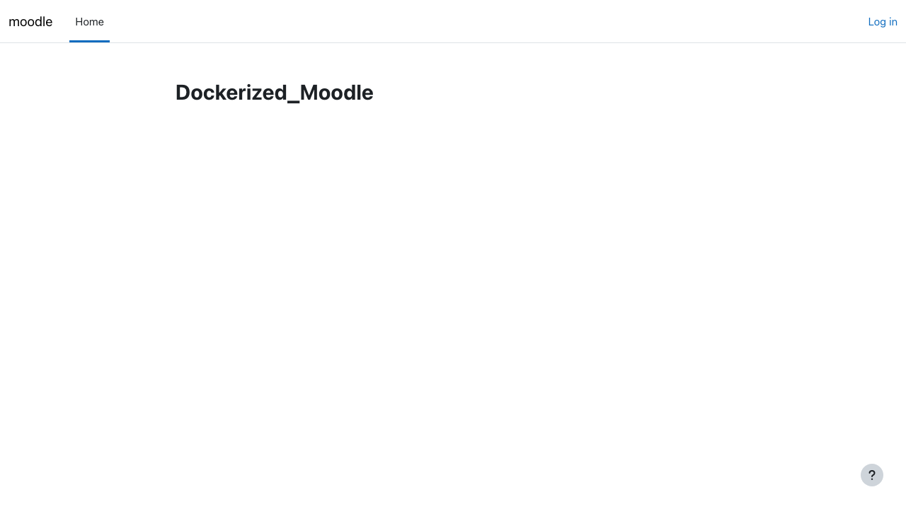
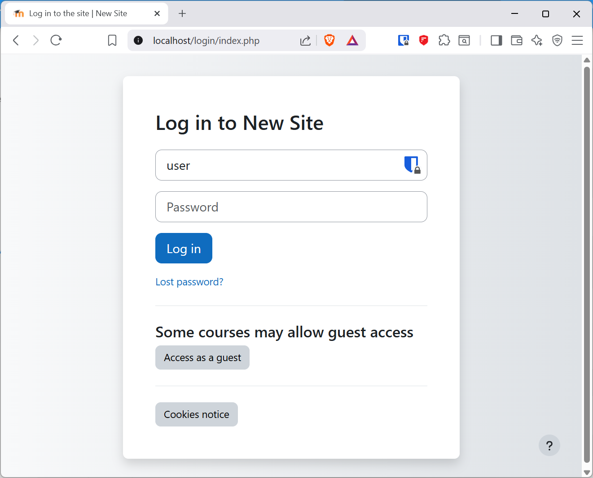
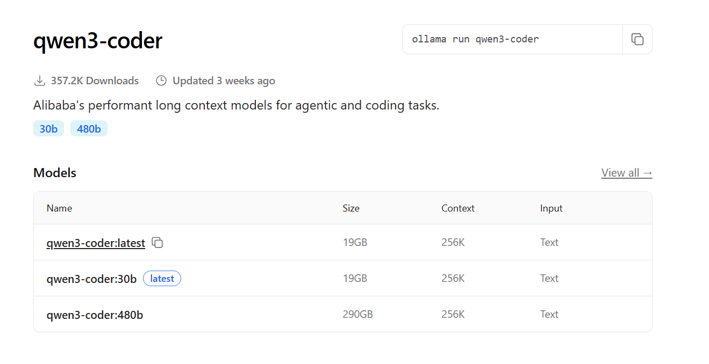

# Bab 3: `Setup` Moodle dengan `Docker Compose`

Pada bab ini, kita akan melakukan instalasi Moodle menggunakan `Docker Compose` dengan `image` dari erseco/alpine-moodle. Pendekatan ini memberikan kemudahan dalam `deployment` dan pemeliharaan.

## Pengenalan `Docker Compose`

### Apa itu `Docker Compose`?

`Docker Compose` adalah alat untuk mendefinisikan dan menjalankan aplikasi Docker multi-`container`. Dengan `file` YAML, kita dapat:
- Mengkonfigurasi beberapa `services` (Moodle, PostgreSQL)
- Mendefinisikan `networks` dan `volumes`
- Memulai/menghentikan semua `services` dengan satu `command`

### Pemilihan Docker Image Moodle

#### Situasi Bitnami Docker Images (2024-2025)

Bitnami, yang sebelumnya menjadi pilihan populer untuk Docker images aplikasi, telah mengalami perubahan signifikan:

**Perubahan Platform:**
- Bitnami melakukan transisi dari images berbasis **Debian Linux** ke **Photon Linux** (OS yang dioptimalkan untuk cloud dan security-hardened)
- Images lama berbasis Debian dipindahkan ke "Bitnami Legacy" registry
- Fokus baru pada "Bitnami Secure Images" (BSI) dengan fitur security yang lebih ketat

**Kepemilikan:**
- Bitnami sekarang dimiliki oleh **Broadcom Inc.** (melalui akuisisi VMware)
- Perubahan kepemilikan ini mempengaruhi arah pengembangan dan prioritas produk

**Status Images Moodle:**
- Bitnami Moodle masih tersedia dan aktif di-maintain
- Namun proses transisi ke Photon Linux dan perubahan struktur menyebabkan kompleksitas tambahan
- Ada ketidakpastian jangka panjang terkait dukungan untuk aplikasi tertentu

#### Mengapa Menggunakan erseco/alpine-moodle?

Untuk proyek ini, kita menggunakan `erseco/alpine-moodle` karena:

1. **Stabilitas**: Image berbasis Alpine Linux yang ringan dan stabil
2. **Ukuran Kecil**: Alpine Linux menghasilkan image yang jauh lebih kecil (~100MB vs ~500MB)
3. **Dokumentasi Jelas**: Tidak mengalami perubahan platform yang membingungkan
4. **Pembaruan Aktif**: Maintainer aktif memperbarui untuk versi Moodle terbaru
5. **Kompatibilitas PostgreSQL**: Mendukung PostgreSQL yang lebih modern dan performant dibanding MariaDB
6. **Open Source**: Fully open source tanpa ketergantungan pada vendor besar

## Langkah 1: `Setup` Direktori Proyek

### Membuat Struktur Proyek

1. **Buka Terminal WSL/Ubuntu**

2. **Buat direktori proyek:**
   ```bash
   mkdir ~/moodle-docker
   cd ~/moodle-docker
   ```

3. **Struktur proyek:**

   Dengan Docker volumes yang dikelola Docker, struktur `folder` adalah:
   ```
   moodle-docker/
   ├── docker-compose.yml
   ├── .env (opsional)
   └── .gitignore
   ```

   > **Catatan:** Dengan konfigurasi ini, kita menggunakan Docker managed volumes, bukan bind mounts. Docker akan mengelola penyimpanan data secara otomatis.

## Langkah 2: Membuat Konfigurasi `Docker Compose`

### `File` `docker-compose.yml`

Buat `file` `docker-compose.yml`:

```bash
nano docker-compose.yml
```

Isi dengan konfigurasi berikut:

```yaml
# Konfigurasi Moodle Docker Compose
# Menggunakan erseco/alpine-moodle dengan PostgreSQL

services:
  postgres:
    image: postgres:17-alpine
    restart: unless-stopped
    environment:
      # Konfigurasi Database PostgreSQL
      - POSTGRES_PASSWORD=moodle
      - POSTGRES_USER=moodle
      - POSTGRES_DB=moodle
    volumes:
      # Penyimpanan persisten untuk database (Docker managed volume)
      - postgresdata:/var/lib/postgresql/data

  moodle:
    image: erseco/alpine-moodle:v5.1.0
    restart: unless-stopped
    ports:
      # Petakan port container ke host
      - '80:8080'
      - '443:8443'
    environment:
      # Kredensial admin Moodle
      MOODLE_USERNAME: admin
      MOODLE_PASSWORD: admin123
    volumes:
      # Penyimpanan persisten (Docker managed volumes)
      - moodledata:/var/www/moodledata
      - moodlehtml:/var/www/html
    depends_on:
      - postgres

volumes:
  # Docker managed volumes - otomatis dikelola Docker
  moodledata:
  moodlehtml:
  postgresdata:
```

### Penjelasan Konfigurasi

**Service PostgreSQL:**
- `postgres:17-alpine`: Image PostgreSQL versi 17 berbasis Alpine Linux (ringan)
- `restart: unless-stopped`: Container akan restart otomatis kecuali dihentikan manual
- Environment variables: Konfigurasi database, user, dan password
- Volume: Data PostgreSQL disimpan di Docker managed volume `postgresdata`

**Service Moodle:**
- `erseco/alpine-moodle:v5.1.0`: Image Moodle 5.1.0 berbasis Alpine Linux
- Ports: HTTP (80→8080) dan HTTPS (443→8443)
- Environment: Kredensial admin default (harus diganti di production!)
- Volumes:
  - `moodledata`: File upload pengguna, cache, sessions
  - `moodlehtml`: Source code dan konfigurasi Moodle
- `depends_on`: Memastikan PostgreSQL start sebelum Moodle

**Docker Managed Volumes:**
- Data disimpan di lokasi yang dikelola Docker (biasanya `/var/lib/docker/volumes/`)
- Lebih portable dan mudah di-backup menggunakan perintah Docker

### Variabel `Environment` (.env) - Opsional

Untuk `production` atau keamanan tambahan, buat `file` `.env`:

```bash
nano .env
```

Isi dengan:
```env
# Konfigurasi Database PostgreSQL
POSTGRES_PASSWORD=StrongP@ssw0rd123!
POSTGRES_USER=moodle_user
POSTGRES_DB=moodle_production

# Konfigurasi Admin Moodle
MOODLE_USERNAME=administrator
MOODLE_PASSWORD=SecureAdm1n@Pass2024!
```

Perbarui `docker-compose.yml` untuk menggunakan `.env`:
```yaml
services:
  postgres:
    environment:
      - POSTGRES_PASSWORD=${POSTGRES_PASSWORD}
      - POSTGRES_USER=${POSTGRES_USER}
      - POSTGRES_DB=${POSTGRES_DB}

  moodle:
    environment:
      MOODLE_USERNAME: ${MOODLE_USERNAME}
      MOODLE_PASSWORD: ${MOODLE_PASSWORD}
```

### `File` `Git Ignore`

Buat `.gitignore`:

```bash
nano .gitignore
```

Isi dengan:
```gitignore
# File Environment
.env
.env.local
.env.*.local

# File Cadangan
*.sql
*.tar.gz
*.zip
backup_*

# File IDE
.vscode/
.idea/
*.swp

# File OS
.DS_Store
Thumbs.db
```

> **Catatan:** Dengan Docker managed volumes, kita tidak perlu meng-ignore folder `volumes/` karena data disimpan oleh Docker di lokasi sistem.

## Langkah 3: Menjalankan Moodle

### Memulai `Services`

1. **Tarik `image` Docker:**
   ```bash
   docker compose pull
   ```

   Ini akan mengunduh:
   - `postgres:17-alpine` (~80MB)
   - `erseco/alpine-moodle:v5.1.0` (~450MB)

2. **Mulai `container`:**
   ```bash
   docker compose up -d
   ```

   `Flag` `-d` untuk berjalan di latar belakang (`detached mode`).

3. **Pantau proses `startup`:**
   ```bash
   docker compose logs -f moodle
   ```

   Tunggu sampai melihat pesan yang menunjukkan Moodle siap:
   ```
   moodle-moodle-1  | Starting crond...
   moodle-moodle-1  | Starting web server...
   moodle-moodle-1  | 2025/01/18 10:23:45 [notice] 1#1: start worker processes
   ```

   Proses instalasi pertama memakan waktu 2-5 menit (lebih cepat dari Bitnami).

### Verifikasi `Services`

Periksa status `container`:
```bash
docker compose ps
```

Keluaran yang diharapkan:
```
NAME                IMAGE                         STATUS
moodle-postgres-1   postgres:17-alpine           Up 3 minutes
moodle-moodle-1     erseco/alpine-moodle:v5.1.0  Up 3 minutes
```

## Langkah 4: Mengakses Moodle

### Dari WSL/Linux

Tes dengan `curl`:
```bash
curl -I http://localhost
```

### Dari `Browser` Windows

#### Metode 1: `Localhost`
Buka `browser` dan akses:
- HTTP: `http://localhost`
- HTTPS: `https://localhost` (akan ada peringatan SSL)

#### Metode 2: Alamat IP WSL

Jika `localhost` tidak bisa diakses:

1. **Periksa IP WSL:**
   ```bash
   ip addr show eth0 | grep inet | awk '{print $2}' | cut -d/ -f1
   ```
   
   Contoh keluaran: `172.29.130.195`

2. **Akses melalui IP:**
   - `http://172.29.130.195`
   - `https://172.29.130.195`

Jika berhasil, Anda akan melihat halaman depan Moodle sebelum `login`:



### Kredensial `Default`

`Login` dengan kredensial yang dikonfigurasi di `docker-compose.yml`:
- **`Username`:** `admin`
- **`Password`:** `admin123`



> **PENTING:** Segera ganti `password` `default` setelah `login`, terutama untuk `production`!

## Langkah 5: Konfigurasi Awal

### Ubah `Password` Admin

1. `Login` dengan kredensial `default`
2. Klik menu pengguna (kanan atas)
3. Pilih **Preferences** → **Change password**
4. Masukkan `password` baru yang kuat

### Konfigurasi Situs

1. Navigasi ke **`Site administration`**



2. Konfigurasi:
   - **`Site name`**
   - **`Front page settings`**
   - **`Location settings`** (`timezone`)
   - **`Language settings`**

### Pengaturan Keamanan

1. Buka **`Site administration`** → **`Security`**
2. Konfigurasi:
   - **`Site policies`**
   - **`HTTP security`**
   - **`Notifications`**

## Langkah 6: Manajemen `Container`

### `Command` Dasar

**Mulai `container`:**
```bash
docker compose up -d
```

**Hentikan `container`:**
```bash
docker compose stop
```

**`Restart` `container`:**
```bash
docker compose restart
```

**Hapus `container` (simpan data):**
```bash
docker compose down
```

**Hapus semuanya (termasuk data):**
```bash
docker compose down -v
rm -rf volumes/
```

### Pemantauan

**Lihat `log`:**
```bash
# Semua services
docker compose logs

# Service spesifik
docker compose logs moodle
docker compose logs mariadb

# Ikuti log (real-time)
docker compose logs -f moodle
```

**Periksa penggunaan sumber daya:**
```bash
docker stats
```

**Masuk ke `shell` `container`:**
```bash
# Container Moodle
docker compose exec moodle sh

# Container PostgreSQL
docker compose exec postgres sh

# Atau untuk PostgreSQL psql
docker compose exec postgres psql -U moodle -d moodle
```

## Pemecahan Masalah

### `Container` Gagal `Start`

**Gejala:**
`Container` terus `restart` atau `exit` dengan `error`.

**Solusi:**
```bash
# Periksa log untuk detail error
docker compose logs postgres
docker compose logs moodle

# Jika database corrupt, reset database
docker compose down
docker volume rm moodle-postgresdata
docker compose up -d
```

> **Peringatan:** Menghapus volume akan menghapus semua data!

### `Port` Sudah Digunakan

**Gejala:**
```
Error: bind: address already in use
```

**Solusi:**
Ubah port di `docker-compose.yml`:
```yaml
ports:
  - '8080:8080'  # Ganti dari 80 ke 8080
  - '8443:8443'  # Ganti dari 443 ke 8443
```

Akses Moodle di `http://localhost:8080`

### Tidak Dapat Mengakses dari `Browser`

1. **Periksa apakah `container` berjalan:**
   ```bash
   docker compose ps
   ```

2. **Periksa apakah instalasi selesai:**
   ```bash
   docker compose logs --tail=50 moodle | grep "setup finished"
   ```

3. **Coba IP WSL alih-alih `localhost`:**
   ```bash
   ip addr show eth0
   ```

4. **Periksa `Firewall` Windows**

### `Reset` Instalasi

Untuk instalasi baru (hapus semua data):
```bash
# Hentikan dan hapus container
docker compose down

# Hapus semua volumes (DATA AKAN HILANG!)
docker volume rm moodle-postgresdata moodle-moodledata moodle-moodlehtml

# Atau hapus semua volumes dengan prefix moodle
docker volume ls | grep moodle | awk '{print $2}' | xargs docker volume rm

# Mulai dari awal
docker compose up -d
```

> **Peringatan:** Perintah ini akan menghapus semua data Moodle termasuk database, users, courses, dan files!

## Backup dan Restore

### Backup Data

**Backup Database PostgreSQL:**
```bash
# Backup database ke file SQL
docker compose exec postgres pg_dump -U moodle moodle > backup-$(date +%Y%m%d).sql

# Atau dengan kompresi
docker compose exec postgres pg_dump -U moodle moodle | gzip > backup-$(date +%Y%m%d).sql.gz
```

**Backup Volume Docker:**
```bash
# Backup volume moodledata
docker run --rm \
  -v moodle-moodledata:/data \
  -v $(pwd):/backup \
  alpine tar czf /backup/moodledata-$(date +%Y%m%d).tar.gz -C /data .

# Backup volume moodlehtml
docker run --rm \
  -v moodle-moodlehtml:/data \
  -v $(pwd):/backup \
  alpine tar czf /backup/moodlehtml-$(date +%Y%m%d).tar.gz -C /data .
```

### Restore Data

**Restore Database:**
```bash
# Restore dari file SQL
cat backup-20250118.sql | docker compose exec -T postgres psql -U moodle -d moodle

# Restore dari file terkompresi
gunzip < backup-20250118.sql.gz | docker compose exec -T postgres psql -U moodle -d moodle
```

**Restore Volume:**
```bash
# Restore moodledata
docker run --rm \
  -v moodle-moodledata:/data \
  -v $(pwd):/backup \
  alpine sh -c "cd /data && tar xzf /backup/moodledata-20250118.tar.gz"
```

## Praktik Terbaik

### `Environment` Pengembangan

1. **Gunakan `file` `.env`** untuk konfigurasi
2. **`Backup` rutin** dengan otomatisasi `script` (contoh di atas)
3. **Pantau `log`** untuk deteksi masalah dini
4. **Dokumentasikan perubahan** di `README`
5. **Gunakan Docker managed volumes** untuk portabilitas

### Keamanan

1. **Segera ganti `password` `default`**
2. **Gunakan `password` yang kuat** di `production`
3. **Aktifkan HTTPS** dengan sertifikat SSL yang benar
4. **Pembaruan rutin** untuk `image` Docker
5. **Batasi `port` yang diekspos** di `production`

### Kinerja

1. **Alokasikan sumber daya yang cukup** ke Docker (minimum 2GB RAM)
2. **Gunakan Docker managed volumes** untuk portabilitas
3. **Pemeliharaan** dan pembersihan rutin
4. **Pantau penggunaan sumber daya** dengan `docker stats`
5. **PostgreSQL lebih performant** untuk Moodle dibanding MariaDB/MySQL

## Perbandingan: erseco/alpine-moodle vs Bitnami

| Aspek | erseco/alpine-moodle | Bitnami Moodle |
|-------|---------------------|----------------|
| **Base OS** | Alpine Linux | Photon Linux (dulu Debian) |
| **Ukuran Image** | ~450MB | ~800MB+ |
| **Database Default** | PostgreSQL | MariaDB |
| **Startup Time** | 2-5 menit | 5-10 menit |
| **RAM Usage** | ~400MB | ~600MB+ |
| **Kepemilikan** | Open Source Community | Broadcom (VMware) |
| **Update Frequency** | Regular | Regular (tapi proses transisi) |
| **Dokumentasi** | GitHub README | Comprehensive |
| **Production Ready** | Ya | Ya |
| **Kompleksitas Setup** | Sederhana | Lebih kompleks |
| **Vendor Lock-in** | Tidak | Potensial |

### Keuntungan PostgreSQL vs MariaDB

Moodle merekomendasikan PostgreSQL karena:

1. **Performance**: Query kompleks lebih cepat
2. **Reliability**: ACID compliance lebih ketat
3. **Concurrent Access**: Lebih baik menangani banyak user simultan
4. **Data Integrity**: Foreign key constraints lebih strict
5. **JSON Support**: Native JSON datatype untuk metadata
6. **Full Text Search**: Lebih powerful untuk pencarian konten

Referensi: [Moodle Database Documentation](https://docs.moodle.org/en/Database)

## Kesimpulan

Anda telah berhasil:
- ✅ Memahami situasi Bitnami Docker images dan alasan memilih alternatif
- ✅ `Setup` Moodle dengan `Docker Compose` menggunakan erseco/alpine-moodle
- ✅ Mengkonfigurasi PostgreSQL sebagai database
- ✅ Menggunakan Docker managed volumes untuk penyimpanan persisten
- ✅ Mengakses Moodle dari `browser`
- ✅ Memahami manajemen `container`, backup, dan restore

**Keuntungan Setup Ini:**
- Image lebih ringan dan cepat (~450MB vs ~800MB)
- PostgreSQL lebih performant untuk Moodle
- Tidak ada vendor lock-in
- Setup lebih sederhana tanpa kompleksitas Bitnami
- Docker managed volumes lebih portable

Pada bab selanjutnya, kita akan menjelajahi:
- Administrasi Moodle
- Manajemen pengguna
- Pembuatan `course`
- Konfigurasi lanjutan

---

**Referensi Cepat:**

| `Command` | Deskripsi |
|---|---|
| `docker compose up -d` | Memulai `services` |
| `docker compose down` | Menghentikan dan hapus `container` |
| `docker compose logs -f moodle` | Melihat `log` Moodle |
| `docker compose ps` | Memeriksa status |
| `docker compose exec moodle sh` | Masuk ke `container` Moodle |
| `docker compose exec postgres psql -U moodle` | Akses PostgreSQL |
| `docker volume ls` | Lihat daftar volumes |
| `docker stats` | Monitor resource usage |

**Kredensial Default:**
- Username: `admin`
- Password: `admin123`
- Database: PostgreSQL di port 5432 (internal)

**Selesai!** Moodle sudah siap digunakan. Selanjutnya pelajari cara administrasi sistem.

**Berikutnya:** [Bab 4 - Administrasi Moodle →](administrasi-moodle.md)